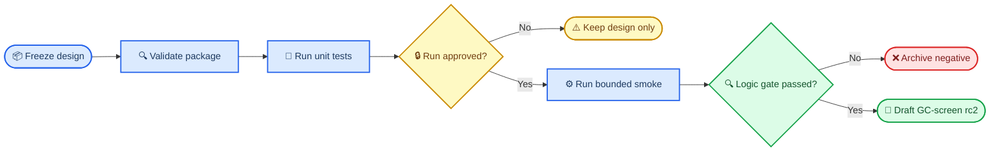

# Grassmann v6.1 bounded-smoke rc2 设计包

_状态：`FROZEN_DESIGN_ONLY`；日期：2026-08-28；等待项目负责人另行批准运行。_

---

## 📋 结论

本包完成 `T09 remediation` 所需的前瞻性 bounded-smoke rc2 设计。它继承共享 subject family、同步 multiplier、真实 target selection 和 D29 rank gate，并绑定 R1.5 的代码与正式服务器结果 hash。

> ⚠️ **证据边界：** 本包尚未运行 smoke。包、validator 或 unit test 的 PASS 都不是 calibration PASS，也不改变 `GC-screen rc1 = FAIL`。

## 🎯 冻结设计

| 项目 | 冻结值 |
| --- | ---: |
| Logic cells | 7 |
| Independent family replicates per cell | 3 |
| Candidate regions per family | 4 |
| Synchronized multiplier resamples per family | 39 |
| Planned independent families | 21 |
| Planned family-level resamples | 819 |
| Planned candidate bootstrap evaluations | 3,276 |
| Rank | 2 |
| D29 minimum relative gap | 0.10 |

实验重复单位是独立生成的 shared-subject family；四个候选和 39 个 resamples 都不是额外独立重复。

## 📍 Gate 流程



## 🔍 本地审计

以下命令只验证设计包，不会运行 bounded smoke：

```bash
python scripts/validate_package.py
python -m unittest discover -s tests -v
```

`scripts/run_bounded_smoke.py` 强制要求一份与当前 `MANIFEST.sha256` 匹配的项目负责人批准记录，并拒绝覆盖已有输出目录。

## 🚫 不授权事项

本包不授权：

- 运行 bounded-smoke rc2
- 运行或起草后直接执行 `GC-screen rc2`
- `GC-final`、T14/T16 power ranking 或任何正式功效结论
- 读取真实 phenotype、discovery 或 replication
- GPU、v7 或任何与 v7 相关的检查和操作

