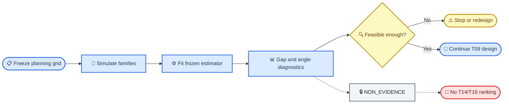

# Grassmann v6.1 非正式设计可行性分析 rc1

_状态：`EXPLORATORY_NON_EVIDENCE`；日期：2026-08-28；不可进入正式证据链。_

---

## 📋 目的

本包在正式 calibration 和 T14/T16 之前回答一个更基础的问题：在预先冻结的样本量、MAF、population eigengap 和真实主夹角网格下，rank-2 方向对象是否经常可估，以及估计的主夹角是否能超过同设计的 null 噪声参考线。

> ⚠️ **永久证据防火墙：** 输出只能支持“停止、缩小科学问题或重新考虑样本设计”。它不能证明方法有效，不能变成 GC/G1 证据，也不能用于选择正式候选、seed、alpha、0.10 gap、rank、effect grid 或方法设置。

## 🎯 分析对象

每个重复是一个独立合成 subject family。网格固定考察：

- `n = 500, 2,000, 10,000, 50,000`
- `MAF = 0.05, 0.10, 0.20, 0.40`
- population relative gap `= 0.05, 0.10, 0.20`
- true maximum principal angle `= 0°, 5°, 10°, 20°, 30°`
- 每格 12 个独立 family replicates

固定标准化信号尺度、残差尺度、conditional-LD 结构、rank 2、ridge `0.01` 和 D29 `0.10`。网格中每个 cell 权重相等只是设计覆盖，不代表真实候选的分布或比例。

## 📍 解释流程



## 📊 输出指标

| 指标 | 含义 | 非含义 |
| --- | --- | --- |
| `group_count_pass_rate` | 三个 genotype 组均 `n_g >= 50` 的频率 | 正式入组率 |
| `gap_pass_rate` | fitted minimum relative gap `>= 0.10` 的频率 | 真实候选 gap 分布 |
| `joint_estimable_rate` | 同时通过 group count 与 gap 的频率 | G0A PASS |
| `estimated_angle_deg` | fitted `M_0` 与 `M_2` 的最大主夹角 | 无偏效应估计保证 |
| `null_exceedance_rate` | gated statistic 超过同 `(n,MAF,gap)` null 95% MC 参考线的频率 | p 值或正式 power |

`null_exceedance_rate` 只叫 detectability proxy。12 个重复不足以支撑尾部校准、方法排序或 confirmatory power。

## 🔍 可复现运行

```bash
python scripts/validate_package.py
python -m unittest discover -s tests -v
python scripts/run_feasibility.py --output-dir results/non_evidence_run_rc1
```

运行脚本拒绝覆盖已有目录，并在每个结果文件与报告中写入 `NON_EVIDENCE`。

## 🚫 不授权事项

- 不改变 `GC-screen rc1 = FAIL`
- 不授权 bounded-smoke、`GC-screen rc2`、`GC-final` 或真实数据
- 不生成 family maxT p 值或正式 FWER
- 不比较 baseline 或排列方法优劣
- 不进入 T14/T16 power ranking
- 不访问 GPU 或 v7

