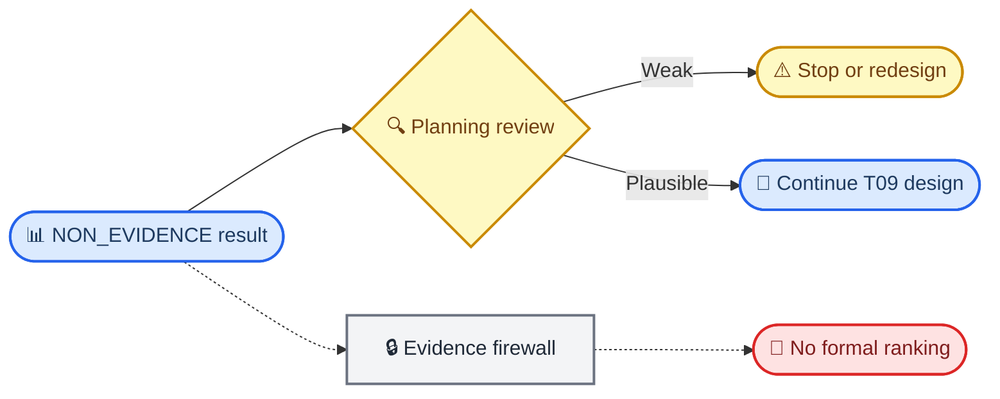

# Grassmann v6.1 非正式设计可行性结果

_Classification: `EXPLORATORY_NON_EVIDENCE`; this report is permanently excluded from the formal evidence chain._

---

## 📋 结论

机器生成的非正式 planning label 是 `STOP_REVIEW`。在预先定义的 planning subset 中，workable grid-cell fraction 为 `0.010`。这只是等权设计格比例，不是真实候选比例。

> ⚠️ **证据边界：** `null_exceedance_rate` 是 12-replicate Monte Carlo detectability proxy，不是 p 值、正式 power、FWER 或方法排名。

## 📊 中心边界切片

下表固定 population gap `0.10`、true angle `20°`，展示样本量和 MAF 对可估性的影响。完整网格见 `summary.tsv`。

| n | MAF | Expected n2 | Group pass | Gap pass | Joint estimable | Null exceedance | Median fitted angle |
| ---: | ---: | ---: | ---: | ---: | ---: | ---: | ---: |
| 500 | 0.05 | 1.3 | 0.000 | 1.000 | 0.000 | 0.000 | 76.60° |
| 500 | 0.10 | 5.0 | 0.000 | 0.833 | 0.000 | 0.000 | 78.65° |
| 500 | 0.20 | 20.0 | 0.000 | 0.833 | 0.000 | 0.000 | 69.78° |
| 500 | 0.40 | 80.0 | 1.000 | 0.833 | 0.833 | 0.000 | 77.27° |
| 2000 | 0.05 | 5.0 | 0.000 | 0.667 | 0.000 | 0.000 | 78.28° |
| 2000 | 0.10 | 20.0 | 0.000 | 0.833 | 0.000 | 0.000 | 77.38° |
| 2000 | 0.20 | 80.0 | 1.000 | 0.750 | 0.750 | 0.250 | 81.81° |
| 2000 | 0.40 | 320.0 | 1.000 | 0.750 | 0.750 | 0.083 | 72.40° |
| 10000 | 0.05 | 25.0 | 0.000 | 0.667 | 0.000 | 0.000 | 59.64° |
| 10000 | 0.10 | 100.0 | 1.000 | 0.333 | 0.333 | 0.083 | 53.49° |
| 10000 | 0.20 | 400.0 | 1.000 | 0.500 | 0.500 | 0.083 | 63.08° |
| 10000 | 0.40 | 1600.0 | 1.000 | 0.500 | 0.500 | 0.083 | 44.29° |
| 50000 | 0.05 | 125.0 | 1.000 | 0.167 | 0.167 | 0.083 | 37.33° |
| 50000 | 0.10 | 500.0 | 1.000 | 0.417 | 0.417 | 0.083 | 42.73° |
| 50000 | 0.20 | 2000.0 | 1.000 | 0.417 | 0.417 | 0.083 | 57.16° |
| 50000 | 0.40 | 8000.0 | 1.000 | 0.500 | 0.500 | 0.083 | 39.84° |

## 🔍 解释路径

## 🚫 不可作出的结论

- 不能把 grid-cell fraction 解释为真实候选中可检测者的比例
- 不能据此选择正式样本量、MAF cut、effect size、seed、rank 或 gap threshold
- 不能把结果并入 GC-screen、GC-final、T14、T16 或真实 phenotype 证据
- 不能把继续设计解释为方法已通过 calibration
