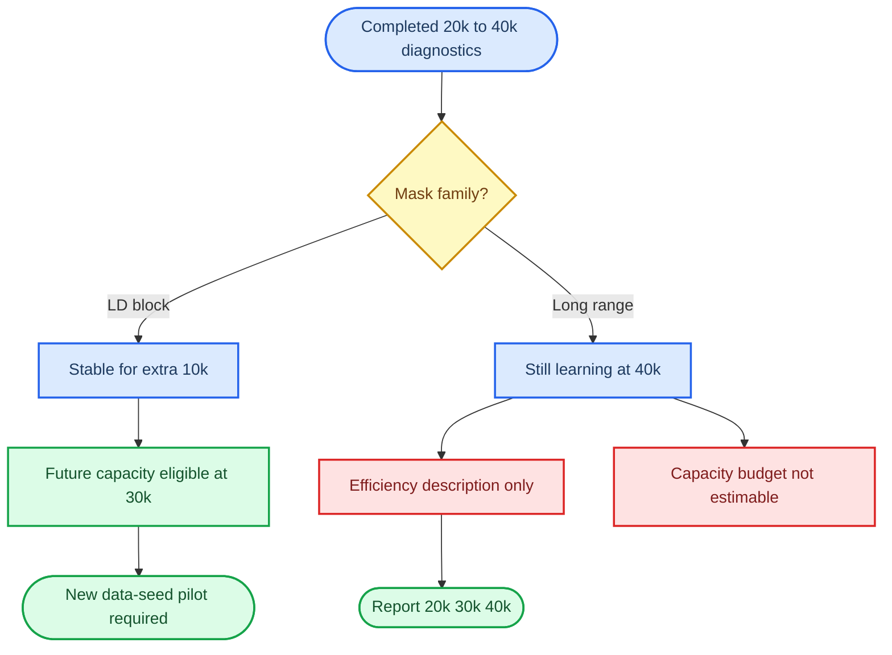

# v7.3.0 estimand and mask-family fork

_Prospectively frozen after the immutable v7.2.4 decision `FINAL_BUDGET_40K_NOT_ADEQUATE_STOP`; this release performs CPU-only auditing and authorizes no training._

---

## 📋 Purpose and evidence boundary

v7.2.4 completed all six selected-LR cells without failure. The three
`ld_block_0p90` cells remained stable from 30k through the additional 10k-step
diagnostic, while all three `within_chrom_longrange_0p90` cells were still learning
at 40k. GPC-longrange passed the trailing-window rule at 30k and failed it at 40k,
which empirically falsifies the use of a single trailing-window pass as sufficient
evidence of training adequacy.

This release separates the scientific questions and the mask-family eligibility
rules. It may read only tuning trajectories and immutable result metadata. It may not
read the decision holdout, HGDP, phenotype labels or formal A1-R outcomes. It may not
start GPU work or produce an architecture GO/NO-GO decision.

## 🎯 Frozen estimands

### A1-EFFICIENCY

`A1-EFFICIENCY` asks how the model ranking and paired differences depend on a fixed,
common and prospectively declared compute budget.

- Report all registered checkpoints at 20k, 30k and 40k; selecting one checkpoint
  after seeing its ranking is forbidden.
- The ranking is a property of the architecture-budget pair, not an asymptotic
  architecture property.
- Positive and negative results are both descriptive. Neither may be promoted to a
  capacity GO or capacity NO-GO.
- Existing single-seed tuning diagnostics may be used only for planning. A later
  efficiency experiment requires a new frozen schedule and independent repetitions.

### A1-CAPACITY

`A1-CAPACITY` asks whether a paired architecture effect or a sufficiently precise
equivalence result remains after training adequacy has been independently supported.

| Mask family | Capacity status | Frozen basis |
| --- | --- | --- |
| `ld_block_0p90` | `ELIGIBLE_FOR_CONFIRMATORY_30K` | Stable at 30k and remained stable through an extra 10k-step out-of-sample persistence check |
| `within_chrom_longrange_0p90` | `INCONCLUSIVE_BUDGET_NOT_ESTIMABLE` | All three cells still learned at 40k and no defensible finite horizon was identified |

Eligibility is not a result. The current one-seed optimization diagnostics cannot be
read as capacity evidence. LD capacity testing still requires a new paired, multi-seed
confirmatory experiment with its analysis and precision rules frozen in advance.

## 🧪 Replication and variance rules

The independent repetition unit for the planned A1-R inference is the `data_seed`.
Evaluation checkpoints on one trajectory are repeated measurements, not independent
replicates. Different mask or initialization seeds do not become data-seed replicates.

The CPU audit may calculate a historical within-arm dispersion proxy when at least two
old runs exist, but it must report the seed types and label the estimate
`PLANNING_PROXY_ONLY`. It cannot replace the planned n=5 data-seed pilot.

For paired arms A and B, `sqrt(2) * within_arm_SD` is not an unconditional upper
bound; it assumes equal variances and zero covariance. With covariance unknown, the
conservative standard-deviation bound is `SD(A-B) <= SD(A) + SD(B)`.

## 🔬 Retrospective tail and resume rules

v7.2.4 prospectively froze tail-five changes over 34k-36k, 36k-38k and 38k-40k.
It did not freeze an H=5 tail-slope, a `0.3 * delta_min` threshold or an uncertainty
Gate. Any such calculation is `POST_HOC_STOP_AND_PLANNING_ONLY`: it may support
stopping or future design, but never a GO direction.

The observed 30k-to-30.25k change is not a pure resume discontinuity because it
combines 250 optimizer steps, evaluation variation and any checkpoint effect. The CPU
audit records it only as a conservative boundary-associated upper bound. Future
confirmatory runs should complete in one process. If resume is unavoidable, the exact
checkpoint must be reevaluated with identical validation masks before any optimizer
update, and that paired boundary difference must enter the reproducibility budget.

## 🚫 Learning-rate decay firewall

The constant-LR `0.002` operational rule is not valid for a WSD or cosine-decay tail.
Reducing the LR from `4e-4` toward `4e-5` mechanically shrinks the terminal change and
can freeze unequal training progress. A decay phase needs a separately signed
adequacy estimand and criterion. No v7.2.4 decay schedule remains authorized.

## 📊 CPU audit outputs

The audit must verify the selected-LR 20k-to-30k-to-40k lineage, reproduce family
eligibility from within-cell trajectories, report false-plateau cells, record resume
boundary upper bounds and characterize the available historical replication levels.
It must not emit an architecture ranking, paired architecture delta, GO/NO-GO or
decision-holdout statistic.

Successful completion returns `ESTIMAND_FAMILY_AUDIT_PASS_NO_GPU_AUTHORIZED`.
This status authorizes drafting the next experimental contract only. It does not
authorize a variance pilot, formal A1-R, HAPNEST or any GPU process.
