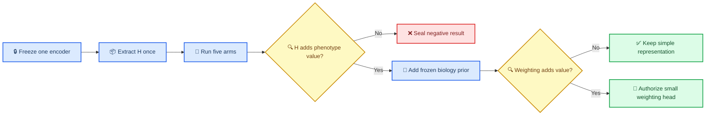
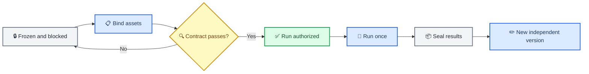

# 0526 Stage 2 phenotype bridge 冻结协议

_版本 `rc1`｜冻结日期 2026-09-15｜状态 `FROZEN_EXECUTION_BLOCKED`｜内部预注册协议，不是完成结果_

---

## 📋 决策摘要

本协议恢复并锁定 2026-05-26 的两阶段逻辑。Stage 1 的既有 genotype-only 工作只作为选择一个冻结表示的前置资产，不再扩展成新的 foundation-model attribution 课题。当前唯一主要问题是：

\[
\boxed{\text{Does a frozen genotype-pretrained representation add out-of-sample phenotype information beyond covariates and a strong additive genotype baseline?}}
\]

Grassmann 的职责被限制为 phenotype bridge 中的一个候选表示臂。它不再承担默认 backbone、默认压缩器、whole-genome memory、互作发现器或因果解释器的职责。

本协议已经冻结科学问题、五个比较臂、主要 estimand、阈值、多重性、停止规则和修改规则。由于当前尚未绑定一个合法可用的 individual-level genotype–phenotype cohort、具体 trait、checkpoint 和功效报告，正式 phenotype 运行维持 `NO-GO`。这些字段必须在不读取 representation-specific outcome 的条件下写入新的 `rc2` 绑定版本；不得直接修改本 `rc1`。

## 🎯 0526 路线与当前接续点

禁止在 `extract H` 前插入 SNPBag/GenoBERT 横向审计、LD attribution、whole-genome scaling 或新的 Grassmann rank/metric 课题。若原 checkpoint 无法与合格 phenotype cohort 对齐，只允许按预先顺序选择一个工程 fallback；模型选择本身不是研究终点。

## 📚 AF、MAF 与 residual 的冻结定义

对双倍体、双等位 SNP \(j\)，以 `ALT` allele 为定向计数，个体 dosage \(g_{ij}\in\{0,1,2\}\)。仅在已调用基因型上定义：

\[
AF_j=\frac{\sum_i g_{ij}}{2n_{\mathrm{called},j}},\qquad
MAF_j=\min(AF_j,1-AF_j).
\]

`AF` 是 ALT allele frequency，范围为 `[0,1]`，保留 REF/ALT 方向；`MAF` 是 minor allele frequency，范围为 `[0,0.5]`，不保留 ALT 是否为 minor allele。个体的定向 dosage residual 必须写成：

\[
r_{ij}=g_{ij}-2AF_j,
\]

不能写成 \(g_{ij}-2MAF_j\)。例如四人的 ALT dosage 为 `0,1,2,2`，则 `AF=0.625`、`MAF=0.375`、期望 ALT dosage 为 `1.25`；使用 `2×MAF=0.75` 会制造错误均值。allele flip 后 \(g'=2-g\)、\(AF'=1-AF\)，因此 \(r'=-r\)，这是应被保留的有方向等变关系。

所有 AF、MAF、标准化量、PCA、低秩基和缺失填充值只允许由训练个体估计，并原样应用到 validation/test。

## 🧪 冻结的实验对象

### Cohort 和 trait

首轮只允许一个 quantitative laboratory trait。选择必须在结果盲态下按以下顺序完成：

1. 合法授权和 individual-level genotype–phenotype 同时可用；
2. trait 定义、单位、采样时间和缺失机制可审计；
3. 有足够样本检测 `ΔR²=0.005`；
4. 有固定、非 outcome-driven 的 covariate 集；
5. 有不参与 representation 构造的 GWAS/gene/LD anchor；
6. 若多个 trait 同时合格，按稳定 trait accession/field ID 的字典序选择第一个，而不查看任何 representation 表现。

`rc1` 不虚构具体 trait。`rc2` 必须写入唯一 cohort ID、trait ID、单位、访问授权、提取日期、样本数、缺失规则和数据哈希后才能运行。

### Encoder 和 H

只冻结一个 genotype-pretrained encoder。选择优先级为：

1. 与目标 cohort 的 build、variant panel、dosage/phasing 输入和许可兼容的既有项目 checkpoint；
2. 若第一项因预先记录的工程不兼容失败，使用预先绑定版本和哈希的一个公开 checkpoint；
3. 两项都失败则停止，不比较多个 backbone 来挑最好结果。

在 phenotype outcome 解盲前，`rc2` 必须冻结 checkpoint SHA-256、代码版本、输入 panel、build、REF/ALT、block定义、输出层、pooling 和最终 \(H\) 张量形状。encoder 全程冻结，对每个个体只提取一次 \(H\)。

## ⚙️ 五臂比较

所有臂使用相同 individual split、trait、covariates、训练信息、outer test、ridge decoder family、正则网格和调参预算。

| Arm | 输入 | 冻结问题 |
| --- | --- | --- |
| A | Covariates | 非遗传预测基线 |
| B | A + 同 SNP panel 的 additive dosage ridge | 简单加性遗传信息上限 |
| C | A + Full/aligned \(H\) | genotype pretraining 是否超过 Arm B |
| D | A + aligned low-rank \(H\) | 保留方向和坐标的压缩能保留多少 |
| E | A + Grassmann subspace of \(H\) | 仅保留 subspace 是否仍携带 phenotype 信息 |

Arm C 是信息上界，不要求与 D/E 同字节。Arm D 与 E 必须使用相同 rank、相同序列化字节、相同 decoder 和相同 hyperparameter budget。若无法精确 byte-match，主分析改为 rank/dimension matched，并把 byte curve 列为预先指定 sensitivity；不能选择对 Grassmann 最有利的预算点作为主结果。

### Covariate arm

默认候选集合为 age、age²、sex、age×sex、前 10 个 train-fitted genetic PCs、genotyping array、assessment center 和可验证 batch。trait-specific covariates 必须在 `rc2` 中从数据字典和测量流程预先加入；test 打开后不得增删。所有分类变量的 levels、missing indicator 和变换必须在 train 上拟合。

### Decoder 和 tuning

- Primary decoder：ridge regression
- Primary loss for tuning：validation mean squared error
- Ridge grid：`10^(-6),10^(-5),...,10^6`
- Tie-break：选择更强正则，即更大的 `alpha`
- Outcome scale：通过 cohort 官方 QC 后，以 train mean/SD 标准化；validation/test 使用 train 参数
- Test evaluation：单次 locked evaluation
- Nonlinear decoder：首轮禁止；只有主 phenotype gate 通过后才允许在新版本作为 sensitivity

## 📊 Primary estimands 与验收阈值

预测 \(R^2\) 冻结为 test 集上的：

\[
R^2=1-\frac{\sum_i(y_i-\hat y_i)^2}{\sum_i(y_i-\bar y_{train})^2}.
\]

不使用 squared Pearson correlation 代替，因为相关性不能惩罚尺度和校准错误。

### 三个确认性对比

| ID | 对比 | Estimand | 通过标准 |
| --- | --- | --- | --- |
| P1 | B − A | `ΔR²_additive` | 点估计 `≥0.005` 且 Holm-adjusted 95% CI 下界 `>0` |
| P2 | C − B | `ΔR²_pretraining` | 点估计 `≥0.005` 且 Holm-adjusted 95% CI 下界 `>0` |
| P3 | E − D | `ΔR²_grassmann_vs_aligned` | 非劣界 `−0.002`；CI 下界 `>−0.002` 为非劣，CI 下界 `>0` 且点估计 `≥0.002` 才称优越 |

三个对比构成唯一 primary multiplicity family，使用 Holm family-wise error control，双侧 family-wise `α=0.05`；P3 的非劣检验按预先方向执行。报告未经调整和调整后区间，但结论以调整后结果为准。

### Grassmann 履职的分级标准

| 等级 | 条件 | 决策 |
| --- | --- | --- |
| G0 描述履职 | E − A 点估计 `≥0.005` 且调整后 CI 下界 `>0` | 可称 Grassmann 表示携带 phenotype-relevant information |
| G1 架构履职 | 同时满足 G0，且 E 对 D 非劣 | 可保留为 phenotype bridge 候选臂 |
| G2 优势 | E − D 点估计 `≥0.002` 且调整后 CI 下界 `>0` | 才能声称相对 aligned 有增量价值 |
| Fail | E 无增量或明确劣于 D | 退为 subspace 描述/解释工具，不进入主模型 |

P2 失败时，0526 的关键 genotype-pretraining → phenotype 桥判为 `NO-GO`；不得用 biological prior、CropARNet 或增加模型规模补救同一个 locked test。

## 🔍 分析、重复与功效

### Split

- Relatedness-component disjoint `70/15/15` train/validation/test
- 在 sex、ancestry 和预先定义的 trait missingness stratum 内平衡
- Split seed 在 `rc2` 中冻结
- 同一家系或 kinship connected component 不得跨 split

### 不确定性

- `5,000` 次 paired cluster bootstrap
- 重采样单位为 family/kinship component；无亲缘者各自为一个 component
- 所有 arms 在每次 bootstrap 中使用相同重采样索引
- SNP、region、mask 和训练 seed 不作为独立 participant 重复

### 功效

目标为在 Holm 最不利门槛下，对 `ΔR²=0.005` 达到至少 `80%` power。样本量通过不接触 confirmation outcome 的 pilot variance 或完全独立数据模拟确定。`rc2` 必须包含脚本、假设、seed 和功效曲线；功效不足时停止或更换 cohort，不能降低 SESOI。

## 🔗 Biological grounding 与后续 weighting

只有 P1、P2 均通过后才能进入该阶段。GWAS/gene/LD prior 必须在不查看 Arm C/D/E test 表现的情况下冻结来源、版本、build、allele alignment、locus/window 和权重公式。

后续增加两个对照：

- Pure prior：只使用 biological prior
- Random matched prior：按 marker count、MAF、LD score、gene density 和距离匹配

候选结构与 prior 加权相对 Arm C 的增量门槛为 `ΔR²≥0.002` 且 paired 95% CI 下界 `>0`。只有通过后，才允许建立 CropARNet-style dynamic weighting head。该 head 必须与固定 pooling 共用冻结 \(H\)，并在新版本、新 test 上验证；不得回到已经打开的 Stage 2 test 调参。

## 🚫 禁止项与停止规则

以下事项从 `rc1` 起冻结禁止：

- 不再重新研究 masked pretraining 是否学习 LD
- 不做 SNPBag、GenoBERT、Transformer、Mamba 的横向选优
- 不新增 Grassmann metric/rank 搜索来改善 Arm E
- 不做 whole-genome compression 或大模型 scaling
- 不把 genotype residual 自动称为 biological signal
- 不把候选 region、GWAS overlap 或 gene annotation称为 causal/interaction evidence
- 不在 test 打开后更换主指标、SESOI、rank、decoder、covariates或比较族
- 不把失败运行删除、覆盖或重命名成 pilot
- 不把 smoke、development、同 cohort random split 称为外部复制

顺序停止规则：Gate 0 数据资格失败即不提取 phenotype；P1 失败即报告 trait 无足够 additive headroom；P2 失败即关闭 phenotype bridge；P3 失败只关闭 Grassmann 主模型资格，不否定 Full H 或 aligned H。

## 🔒 防止 8 月底事故的冻结机制

1. `rc1` 永不原地改写；任何绑定或科学修改生成新版本
2. `CONTRACT.json` 未达到 `RUN_AUTHORIZED` 时，runner 必须 fail closed
3. data、checkpoint、split、code、protocol 和 config 均写 SHA-256
4. development/calibration/test 输出物理分目录，test runner 不接受 development 路径
5. test 打开后只允许修复不改变数值的展示问题；任何影响结果的修复必须封存本次为 invalid，并使用新的独立 test
6. 所有 failure、stderr、exit code 和 partial artifact 原样保留
7. 结果聚合器只读取 manifest 中声明的 run IDs，不扫描目录自动吸收额外实验
8. `AMENDMENTS.md` 只追加，不删除历史；每次修改记录是否接触 outcome

## 📦 当前 Gate 状态

| Gate | 状态 | 原因 |
| --- | --- | --- |
| Scientific question | Pass | 0526 Stage 2 问题已冻结 |
| Five-arm design | Pass | A–E、decoder 和 contrasts 已冻结 |
| Thresholds | Pass | SESOI、NI margin、CI、Holm 已冻结 |
| Authorized cohort | Blocked | 当前无已核验 individual-level phenotype cohort |
| Trait binding | Blocked | 唯一 quantitative lab trait 尚未绑定 |
| Encoder binding | Blocked | checkpoint/panel/output/hash 尚未绑定 |
| Power | Blocked | 尚无 outcome-blind power report |
| Formal execution | No-go | 上述四项未完成 |

当前允许的下一步只有 metadata/authorization 核验、trait与checkpoint绑定、坐标/等位基因合同、split 和 power 计算。禁止运行任何 representation-specific phenotype test。

## 🧾 内部证据与追溯

| Evidence ID | 文件 | 用途 |
| --- | --- | --- |
| E001 | `proof_previouswork/20260526.pdf` | 0526 两阶段科学逻辑和 Stage 2 定义 |
| E002 | 用户提供的 2026-09-15 路线说明 | 明确停止 attribution 改线并恢复 0526 |
| E003 | `presentation_20260910/Grassmann_方向决策汇报_探索逻辑版_内容.md` | 1–13 次实验的边界与 effect-space 决策 |
| E004 | `local_exploratory/20260909_real_multivariate_grassmann_fair_gate_rc1/REPORT.md` | 当前 Grassmann memory 被 aligned PCA 支配的内部证据 |
| E005 | `local_exploratory/20260914_genotype_fidelity_gate0_data_independence_rc1/GATE0_STATUS.json` | 当前真实 phenotype 数据资格为 NO-GO |
| E006 | `local_exploratory/20260909_real_hapmap_high_ld_residual_gate_rc1/REPORT.md` | genotype residual 存在但未证明 phenotype utility |

精确源文件哈希记录于 `SOURCE_MANIFEST.tsv`。这些是内部研究记录，不是投稿级外部验证。协议由 AI 协助整理；负责人必须在 `rc2` 授权前核对 trait、数据许可、estimand、功效和所有绑定资产。

