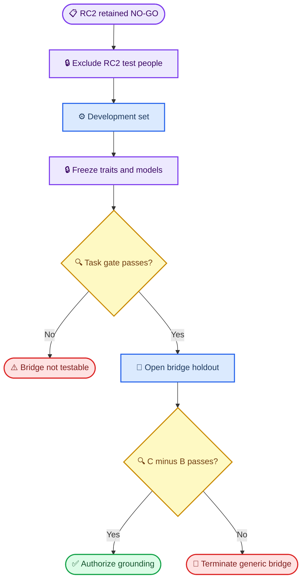

# 0526 Stage 2B Bridge Replication Gate rc0

_Draft protocol · 2026-09-15 · not frozen, not runnable, and no new phenotype outcomes accessed_

---

## 🎯 Scientific decision

Stage 2B asks one question:

> When genotype-to-phenotype prediction is independently shown to be detectable, does a frozen genotype-pretrained full hidden representation `H` improve held-out predictive R² over the same-panel additive dosage model?

The primary estimand remains `C-B`. Stage 2B does not rescue RC2 and does not re-test whether pretraining can learn LD/MAF structure.

## 📋 Sequential design

### Independent analysis partitions

One fixed sample manifest must allocate every eligible individual to exactly one role before outcome analysis:

| Partition | Allowed use | Forbidden use |
| --- | --- | --- |
| Development | Trait/panel selection, pretraining, decoder tuning, design simulation | Confirmatory claims |
| Task-gate holdout | Evaluate genotype task eligibility using `B-A` | Tune traits, encoder, decoder, rank, or threshold |
| Bridge-test holdout | Evaluate frozen `C-B` primary contrast | Any prior selection or tuning |

All 15 RC2 test individuals are excluded from every Stage 2B partition. Families are indivisible allocation groups. Allocation is stratified by population so the primary bridge comparison does not become a hidden ancestry-transfer experiment.

Holding out one complete population is reserved for a secondary transportability analysis. It cannot be the sole primary bridge test because that would confound representation quality with population shift.

## 🔍 Task Gate

The Task Gate measures incremental genotype predictability as `B-A`, not `R²(B)` alone. A high absolute `R²(B)` caused by sex, ancestry, batch, or another covariate is not evidence that dosage predicts the phenotype.

### Trait-panel construction

- Use a small fixed panel of cis-expression traits rather than one train-variance winner
- Require external cis-eQTL support that is independent of the Stage 2B bridge-test individuals, or select using Development only
- Freeze transcript IDs, genome build, cis windows, allele orientation, expression transform, missingness rules, and all exclusions before opening Task-gate outcomes
- Freeze one macro-averaged primary task estimand across the full trait panel; retain trait-specific results as secondary

### Eligibility rule to freeze

Before this protocol can become `rc1 FROZEN`, it must specify both:

1. A positive Task-gate rule for macro-averaged `R²(B)-R²(A)` with an individual-clustered uncertainty interval
2. A design-sensitivity target showing that the Bridge-test sample size has adequate probability to detect the predeclared bridge effect scale

The Task-gate threshold must be chosen from Development-only simulations and scientific relevance before Task-gate outcomes are opened. RC2's observed `C-B`, `D-B`, or test residuals must not be used as the assumed Stage 2B effect.

If Task Gate fails, the Bridge-test outcomes remain unopened and the disposition is `TASK-INELIGIBLE`, not `BRIDGE NO-GO`.

## 🧪 Bridge Gate

### Frozen arms

| Arm | Representation | Role |
| --- | --- | --- |
| A | Fixed covariates and train-fitted genotype PCs | Non-genetic/structure reference |
| B | A plus additive dosage from the same cis panels | Task baseline |
| C | A plus full coordinate-aligned frozen `H` | Primary representation |
| D | A plus frozen rank-4 aligned low-rank `H` | Secondary registered hypothesis |
| E | A plus frozen rank-4 Grassmann projector and spectrum | Secondary mechanism arm |

Encoder architecture, masked-genotype objective, rank, ridge family, alpha grid, preprocessing order, and deterministic tie rules inherit RC2 unless a change is justified before data access and recorded as a new protocol version. No new model family is allowed in Stage 2B.

### Primary analysis

For a frozen panel of `K` traits, define one macro-average primary estimand:

`mean_k[R²(C_k) - R²(B_k)]`.

Uncertainty uses paired individual-cluster bootstrap: the same test individuals are resampled across all traits and arms. Traits are not treated as independent people. The bridge is supported only when the point estimate and the 95% interval lower bound are both greater than zero.

`D-B`, `E-B`, and trait-specific contrasts are secondary. They must all be reported but cannot gate or redefine `C-B`.

## ⚠️ Frozen interpretation states

| Task Gate | Bridge Gate | Interpretation | Next action |
| --- | --- | --- | --- |
| Fail | Unopened | Task insufficient | Acquire a genuinely informative task; no bridge claim |
| Pass | Pass | Bridge supported | Permit a new weighting/biological-grounding protocol |
| Pass | Fail | Bridge NO-GO under high-signal replication | Terminate generic 0526 bridge as the default program |

No state permits returning to the RC2 test subjects or tuning `D/E` on confirmatory outcomes.

## ✍️ Requirements before freeze

- [ ] Acquire and checksum individual-level genotype and expression for the intended GEUVADIS populations
- [ ] Confirm exact sample/population/family overlap and permanently exclude RC2 test IDs
- [ ] Freeze genome build, coordinate normalization, allele orientation, cis-window and panel rules
- [ ] Freeze development/task-gate/bridge-test allocation seed and manifests
- [ ] Freeze the trait panel without using task-gate or bridge-test outcomes
- [ ] Freeze Task-gate estimand, threshold and confidence procedure
- [ ] Run Development-only simulation/sensitivity curves and freeze required Bridge-test N
- [ ] Freeze encoder checkpoint policy and exact A-E feature dimensions
- [ ] Verify all arms share samples, SNPs, covariates, decoder family and test opening time
- [ ] Change status from `DRAFT_NOT_RUNNABLE` only after every item is complete

## 🔗 Evidence sources

GEUVADIS contains RNA-seq data for more than 460 1000 Genomes samples across CEU, FIN, GBR, TSI and YRI populations.[^1] The eQTL Catalogue lists its uniformly processed GEUVADIS study as 445 samples and 445 donors with 1000 Genomes genotypes.[^2]

[^1]: 1000 Genomes Project. “GEUVADIS data collection.” https://internationalgenome.org/data-portal/data-collections/geuvadis/

[^2]: EMBL-EBI. “eQTL Catalogue studies: QTS000013 GEUVADIS.” https://www.ebi.ac.uk/eqtl/Studies/
