# E0 genotype-only local encoder 双轴无泄漏协议

_版本 `rc0` · 2026-09-16 · 状态 `STRUCTURE_FROZEN_ASSET_BLOCKED` · 新协议，不覆盖既有 E0 或 Stage 2 协议_

---

## 📋 决策摘要

E0 从随机初始化训练一个跨区段共享的 local genotype encoder。正式推断只回答：模型能否在新家系和未训练过的 genomic blocks 上，以具有实际意义的幅度优于训练集频率、局部统计模型和 haplotype-copying/HMM 基线。

E0 属于 SNP foundation modelling 与 representation audit。`AF/MAF`、local `LD`、haplotype-related context 和 population structure 是允许保留并主动学习的信号。E0 不推断 phenotype relevance、biological specificity、causality 或 Grassmann 优势。

本协议的结构已经冻结；正式运行仍被 UKB genotype、kinship、genetic map、授权路径和计算资源绑定阻断。所有待绑定字段必须在 test outcome 不可见时写入 `CONTRACT.json`。

```mermaid
flowchart LR
    accTitle: E0 双轴无泄漏流程
    accDescr: Family components 与 genomic blocks 分别被冻结并交叉形成训练、同区段测试和未见区段测试，所有模型共享完全相同的 manifests 和 masks

    genotype[📥 Genotype-only 数据] --> family_split[⚙️ Family component 划分]
    genotype --> block_split[⚙️ Block 与 buffer 划分]
    family_split --> train_cell[🧪 Train families × train blocks]
    block_split --> train_cell
    train_cell --> freeze_model[🔒 冻结 encoder 与 baseline]
    freeze_model --> same_locus[📊 E0-S 新家系]
    freeze_model --> new_block[📊 E0-X 新家系与新区段]
    same_locus --> decision{🔍 两个主终点通过?}
    new_block --> decision
    decision -->|是| foundation_v0[✅ Foundation-v0]
    decision -->|否| bounded_fail[❌ 限定当前配方结论]

    classDef process fill:#dbeafe,stroke:#2563eb,stroke-width:2px,color:#1e3a5f
    classDef decision_style fill:#fef9c3,stroke:#ca8a04,stroke-width:2px,color:#713f12
    classDef success fill:#dcfce7,stroke:#16a34a,stroke-width:2px,color:#14532d
    classDef danger fill:#fee2e2,stroke:#dc2626,stroke-width:2px,color:#7f1d1d

    class genotype,family_split,block_split,train_cell,freeze_model,same_locus,new_block process
    class decision decision_style
    class foundation_v0 success
    class bounded_fail danger
```

## 🎯 科学问题与 estimand

### Positive task

对预先冻结的 mask，估计局部条件分布：

\[
p(G_{masked}\mid G_{observed\ context}, position, AF).
\]

Primary loss 是 masked genotype cross-entropy/NLL。训练、验证和测试使用完全相同的 genotype coding、variant panel、mask 规则和 missingness 规则。

### Co-primary estimands

令 `B*` 为仅在 validation 上从合格非神经基线中选定的最强基线，定义：

\[
\delta_S=\frac{CE_{B^*,S}-CE_{E,S}}{CE_{B^*,S}},\qquad
\delta_X=\frac{CE_{B^*,X}-CE_{E,X}}{CE_{B^*,X}}.
\]

| Estimand | 样本 | 区段 | 解释 |
| --- | --- | --- | --- |
| `δ_S` | test families | seen/train blocks 的独立 masks | 新个体与新家系泛化 |
| `δ_X` | test families | held-out blocks 与其冻结 buffers | 未见区段迁移 |

E0 PASS 要求 `δ_S` 与 `δ_X` 的点估计均至少为 `1%`，且 family × block 双向 clustered 95% CI 下界均大于 `0`。`1%` 是本轮 neural-headroom 的最小有意义相对 CE 改善；仅统计显著而未达到该阈值记为 `STATISTICALLY_POSITIVE_PRACTICALLY_TIED`。

速度、显存和吞吐为独立 efficiency estimands。它们不能把 CE 上的劣势改写为能力优势；若要声称部署价值，必须另行预注册 non-inferiority margin 与速度倍数。

## 👥 Family 轴

### 独立单位

每个已知 pedigree 或 kinship connected component 是一个不可拆分单位；无亲缘个体各自构成 singleton component。默认候选边为 UKB 提供的亲缘关系或冻结 KING-style kinship 阈值 `≥0.0442`。最终字段、软件版本和阈值必须写入 contract。

### 划分

- 以 component 为单位进行 `70/15/15` train/validation/test 划分
- 在 ancestry stratum、sex、genotyping array 和可审计 batch 内平衡 component，而不是拆开 component
- 同一家系或同一 connected component 的任何成员不得跨 split
- 所有 encoder、M0、M1、C/D/E 和后续 phenotype heads 共用同一个 `family_manifest.tsv`
- PCs、AF、标准化量、缺失填补和任何 reference panel 只由 train families 拟合

Family 泄漏可能使坐标保留能力更强的表示获得不成比例的收益，但该方向不是先验定理。开发阶段可额外报告 `random-individual split` 与 `family split` 的 `arm × split` 交互作为泄漏诊断；科学结论只使用 family-disjoint split。

## 🧬 Genomic-block 轴

### Block 构造

1. 统一 genome build、contig 命名、REF/ALT 和 variant normalization
2. 在 train families 或冻结外部 reference 上构造 LD blocks，并记录来源和哈希
3. 在 chromosome 与 block-size/MAF/LD-density strata 内，以冻结 seed 抽取多个**连续 held-out runs**，再将 run 内 LD blocks 标记为 validation 或 test；禁止把单个 held-out block 随机散布到全染色体
4. 将 MHC、常见 inversion 和审计发现的 long-range-LD 区域作为 atomic super-block，或从 primary transfer claim 排除后单独报告

连续 run 是 genomic split 的分配单位，LD block 仍是损失汇总和 bootstrap 的聚类单位。每条染色体应有多个空间分离的 runs，并在染色体位置、block size、MAF 与 LD density 上分层，以免结论由一个特殊区域主导。run 的最小 block 数、目标覆盖比例、每条染色体的 validation/test run 数和 seed 必须在 test 不可见时写入 contract。开发验证表明，散点式 block 留出与逐块 `1 cM` guard 会造成 buffer 膨胀并不必要地耗尽训练区域；正式设计因此只在 held-out run 的外边界设置 guard，run 内 block 之间不重复加 guard。

### Buffer 规则

每个 validation/test held-out run 外边界的初始 guard band 为以下三者的最大值：

- encoder 最大 receptive-field span
- 左右各一个相邻 LD block
- genetic map 上 `1 cM`

随后仅用 train families 审计跨边界 LD。若 guard 外与 core 内仍存在 `r² ≥ 0.1` 的 common-variant pair，则扩展 guard 至通过，或把相关区域合并为 atomic block。任何训练窗口只要与 test core 或 guard 重叠，均从训练集中排除。

`block_manifest.tsv` 至少记录 chromosome、core start/end、guard start/end、genetic-map interval、block source、split、异常 long-range-LD 标记和 SHA-256。所有 arms 共用同一 block manifest。

## ⚙️ 模型、信息与基线

### Encoder E

Primary encoder 从随机初始化训练，输入包括 genotype token、相对/连续位置、train-only ALT `AF` 与 missingness indicator。模型跨 block 共享参数。

为保持 E0-X 可识别，primary encoder 禁止使用 learned global block ID、variant-ID lookup embedding 或 test-block-specific 参数。Ancestry/PC 显式 conditioning 仅可作为预先登记的 secondary recipe；primary 分析通过 ancestry 分层检查迁移。

实现绑定上，历史 `LocalGenotypeEncoder` 的 `legacy_lookup` 模式只用于复现旧 checkpoint，不得用于 E0-X。E0 primary 必须设置 `local_position_mode=relative_continuous` 与 `use_local_block_embedding=false`；位置特征仅由 block 内相对位置、相邻 marker 距离和 block span 构成。代码必须对整体坐标平移保持输出不变，并在传入 block ID 时显式报错。

未分相 dosage 只能支持“局部 LD/联合基因型上下文”结论。只有在输入和 truth 均为合格 phased haplotypes 时，才允许单独提出 phased-haplotype claim。

### 冻结基线层级

| 基线 | 定义 | 角色 |
| --- | --- | --- |
| `M0a` | train-only empirical genotype probabilities，含冻结 smoothing | 边缘频率基线 |
| `M0b` | train-only ALT AF 下的 HWE probabilities | AF/HWE 基线 |
| `M1a` | AF + train PCs/ancestry + 固定邻域 genotype 的正则化 multinomial/boosted predictor | 强局部非神经基线 |
| `M1b` | train families 作为唯一 reference 的 haplotype-copying/HMM imputation | 领域强基线 |

`M1b` 冻结为 Beagle 5.5 `27Feb25.75f` adapter，reference 只含 train families 的 phased、non-missing haplotypes，genetic map 与 block manifest 同 build。它必须使用与 E 相同的 observed/masked sites，并以**单个 held-out individual**为执行单位，禁止任何 test-target 间的信息交换；`ap=true` 与 `gp=true` 的输出必须先在开发数据证明能为每个 masked diploid GT 提供三类概率，才能进入 CE 比较。若全基因组成本不可接受，则在不读取结果的条件下，按 chromosome、block size、MAF 与 LD density 分层抽取冻结 benchmark blocks。此时 neural-headroom 的 strongest-baseline 主张只覆盖该子集；其余 blocks 只能报告相对 `M1a` 的结果。[Beagle 5.5 官方页面](https://faculty.washington.edu/browning/beagle/beagle.html)与[官方参数文档](https://faculty.washington.edu/browning/beagle/beagle_5.5_17Dec24.pdf)是版本与参数契约来源。

`B*` 的选择只看 validation CE，并在 test 解锁前冻结。不得按 test block 逐块挑选对 E 最有利的基线。

## 🧪 训练与评估

### Mask families

- Primary：每个 family × block cell 使用 5 个固定 seeds，随机遮盖 `20%` callable SNPs
- Secondary：连续遮盖 `5/10/20` SNP
- Secondary：若 panel 允许，增加一个冻结 array-like missingness pattern
- 同一 mask manifest 被所有基线和 encoder 逐位置复用

### 模型选择与预算

- 本轮最多评估 `3` 个 encoder recipes，包含 primary recipe
- 每个 recipe 最多 `3` 个 training seeds
- recipe、宽度、深度、context、optimizer、训练 steps 和 early-stopping rule 在 test 前冻结
- 仅用 validation CE 选出一个正式 encoder；test 只打开一次
- mask seeds、training seeds 和 SNP 数不是独立生物学重复，不进入有效样本量
- 三个 recipes 均未达到 validation 预设门槛时，本轮结束，不通过继续增加 recipe 搜索救援

### 统计聚合

Primary point estimate先在每个 family-component × block cell 内对 masked sites 求平均，再对 family components 与 blocks 等权宏平均。使用 `5,000` 次 family 与 block 独立重采样的 two-way clustered bootstrap；同一次重复中所有 arms、seeds 和 masks 使用相同索引。

Secondary 报告包括 Brier score、dosage `R²`、genotype concordance、calibration、MAF bins、LD bins、ancestry strata、missingness pattern、吞吐和峰值显存。所有 secondary results 限定相应 strata，不修改 co-primary 判定。

## 🔒 Manifest 与 test firewall

正式运行前必须生成并哈希：

- `sample_manifest.tsv`
- `family_manifest.tsv`
- `variant_manifest.tsv`
- `block_manifest.tsv`
- `mask_manifest.tsv`
- `baseline_manifest.json`
- `model_manifest.json`
- `data_qc_report.json`
- `CONTRACT.json`

Manifest 必须同时驱动数据加载、训练、评估与 C/D/E 下游 arms；禁止每个 arm 自行重建 split。验证器至少检查 family overlap、core/guard overlap、variant/build/allele 一致性、train-only AF/PC、mask identity 和 hash identity。

Test 目录在 `RUN_AUTHORIZED` 前不可读。首次读取后，即使运行失败也必须保存日志和 partial artifacts；任何改变数值结果的修复进入新版本和新 test，不能覆盖本次运行。

## 🔀 与 phenotype 路线的关系

E0 与 phenotype bridge 是平行问题，不互相充当唯一通行证：

- E0 问 encoder 是否学到并迁移 genotype distribution
- Phenotype-P 问冻结 `H` 是否相对同 panel raw/additive genotype baseline 增加 out-of-sample phenotype information

可以在 E0 encoder 冻结后运行一个预注册 phenotype probe，但 phenotype outcome 不得用于选择 E0 recipe、layer、rank、seed、mask 或 checkpoint。Phenotype probe 至少共用 family manifest，并使用单独冻结的 trait、covariates、decoder、SESOI、power 与 test firewall。

SNPBag 目前的官方仓库提供 inference demo、示例 embedding 和论文复现资产，但未提供可下载的 full-genome pretrained weights；公开 issue 仍在请求模型权重和发布时间。[^1][^2] 因此 SNPBag 路线当前状态为 `BLOCKED_UPSTREAM_WEIGHTS`，只能做代码/panel/license adapter 审计，不能承诺本地 `C vs B` checkpoint benchmark。若未来权重发布，必须先冻结 checkpoint hash、variant panel、build、phasing 和 hidden-output contract，再作为独立 benchmark 接入。

## ✅ 判定与失败边界

| 结果 | 解释 | 允许的下一步 |
| --- | --- | --- |
| `E > M0`，但未超过 `B*` | 学到 context，无 neural headroom | 保留方法学结果；不称 Foundation-v0 |
| `δ_S` 通过，`δ_X` 不通过 | 固定区段 encoder | 可用于 same-panel imputation；不称跨区段 foundation encoder |
| `δ_S`、`δ_X` 均通过 | 支持可迁移 local encoder | 冻结 `Foundation-v0`；phenotype 路线独立评估 |
| 仅部分 ancestry/MAF/LD strata 失败 | 迁移范围受限 | 限定相应 deployment claim |
| 三个 recipes 均失败 | 当前架构/目标预算结束 | 发布负结果；其他 foundation architecture 可另立新协议 |

E0 failure 不否定 genotype foundation modelling，也不停止独立的 phenotype、raw/PCA/local 或其他架构路线。Grassmann 不参与 E0 primary gate。

## 📅 进度与汇报规则

执行期固定在每天 `09:00` 与 `18:00`（`America/Los_Angeles`）写入一次状态报告；关键里程碑或失败立即追加事件报告。若持续目标/会话未处于运行状态，本地日志仍继续写入，但不能把“没有主动聊天推送”误写成任务停止。报告采用以下事件里程碑，不让下载或训练占用交互会话：

| 里程碑 | 报告内容 | 状态 |
| --- | --- | --- |
| `R0` | 协议、SNPBag 权重可用性、F 盘下载审计 | 已完成结构 |
| `R1` | UKB 路径、授权、样本/variant/kinship 资产绑定 | 等待数据 |
| `R2` | family/block/buffer manifests 与泄漏验证 | 待运行 |
| `R3` | M0/M1/HMM validation 与 encoder recipe 冻结 | 待运行 |
| `R4` | 单次 test 解锁与 E0-S/E0-X 结果 | 待运行 |
| `R5` | `Foundation-v0` 或限定负结论、checkpoint 与 hashes | 待运行 |

每次定时报告固定包含当前 milestone、完成项、后台 PID/exit code、资产路径与大小、阻断、下一动作和下一次报告时间。长下载必须用隐藏后台进程，stdout/stderr 写入 F 盘日志；会话只在启动、异常或完成后读取一次状态，不轮询消耗 token。模型训练同理，使用持久日志与 checkpoint，不在前台空等。

## 🔗 内部依据

- [方向纠偏与 AI 失误记录](../../../reports/Grassmann_方向纠偏与AI失误记录_20260915.md)
- [旧 E0 frozen protocol](../../pilots/20260915_tq1_e0_parallel_readiness_rc1/FROZEN_PROTOCOL.zh-CN.md)
- [旧 E0 result](../../pilots/20260915_tq1_e0_parallel_readiness_rc1/results/REPORT.zh-CN.md)
- [Stage 2 bridge rc1](../20260915_0526_stage2_bridge_rc1/PROTOCOL.zh-CN.md)
- [Stage 2 development pilot rc2](../20260915_0526_stage2_bridge_rc2/PROTOCOL.zh-CN.md)

## 🔗 References

[^1]: Xu, A. G., et al. (2025). “SNPBag: A Foundation Model for Multitask Genome-Scale SNP Analysis.” _bioRxiv_. https://www.biorxiv.org/content/10.1101/2025.01.29.635579v2

[^2]: SNPBag contributors. (2025). “Request for Pre-trained Weights & Timeline for SNPBag Full-Genome Model.” _GitHub issue #3_. https://github.com/augix/SNPBag/issues/3
