# Grassmann v6.1 条件上位效应统计路线：会话总结与执行交接

_状态日期：2026-08-28；面向完全没有此前对话上下文的新会话。_

---

## 📋 30 秒摘要

- 整个 v6.1 任务**尚未完成**。当前不是 P0，也没有进入 GC-final 或 power；实际位置是原任务表 `T09 / GC-screen` 的协议修复阶段。
- `T00–T08` 已完成，`G-1` 与 `G0` 正式 PASS；首轮 `GC-screen rc1` 完成 20,000/20,000 次但正式 FAIL，原因是 family p 值过度保守及候选 family/重抽样依赖实现不符合真实共享样本结构。[E01][E04][E05][E06]
- FAIL 后已经完成诊断、共享 family R1 oracle、rank-gated R1.5 oracle。最新正式服务器 Gate 是 `R1_5_RANK_GATE_PASS`，结果 manifest SHA-256 为 `6081484beb28de8641b606ff89aef4edf12c635e8762e1e94b9fb3f9d160de2b`。[E10]
- 最新 Gate **只授权设计**一个使用全新 seed block 的 `bounded_smoke_design_rc2`；它明确不授权运行 bounded smoke、GC-screen rc2、GC-final、power、真实 phenotype、GPU 或任何 v7 工作。[E09][E10]
- 下一会话首先应生成并审计新的 bounded-smoke 设计包，绑定 R1.5 代码 manifest 与上述服务器结果 hash。设计审计完成后，必须再次取得项目负责人批准，才能在服务器运行。
- v7 是独立 GPU 路线。禁止检查、停止、查询、占用、复用或干扰 v7 的任务、BCF、checkpoint、NLL、进程或 GPU。

> **当前裁决：** `GO_PROTOCOL_REWRITE` 仍有效；`NO_GO_FULL_CALIBRATION` 与 `NO_GO_REAL_DISCOVERY` 仍有效。GC-screen rc1 的 FAIL 没有被后续 oracle “洗成” PASS。

## 🎯 任务目标与统计对象

最终目标是在预注册的 `target × region` 候选 family 中，建立多性状条件上位效应检验，同时控制：

- conditional LD
- target 与 region 的加性主效应
- 协变量与 ancestry 等混杂
- 异方差与跨性状残差相关
- rank 可识别性
- 候选 family 的 maxT/FWER

方法把两类效应分开：

1. 幅度是否改变
2. 多性状区域效应的方向子空间是否旋转

对候选区域 `k`，冻结的联合条件模型为：

```text
Y = C alpha + G a + X_k B_k + (G * X_k) Gamma_k + E
M_kg = B_k + g Gamma_k,  g in {0,1,2}
```

primary direction estimand 是 whitened `M_kg` 的 rank-2 左奇异子空间；primary direction statistic 使用三个 genotype level 间归一化投影距离的均值。幅度臂使用 `M_2` 与 `M_0` 的 Frobenius 范数相对差。[E03]

原始分组交叉协方差 `X_g^T Y_g / n_g` 只能作为 diagnostic ablation。conditional LD 会使其近似为 `Sigma_(X|g) M_g`，即使 `Gamma=0` 也可能制造假旋转，因此禁止把它恢复为 primary。[E01][E03]

## 📍 当前 Gate 位置

```mermaid
flowchart LR
    accTitle: v6.1 当前 Gate 路径
    accDescr: v6.1 已完成 P0、G-1 和 G0，首轮 GC-screen 失败后进入诊断与两轮 oracle 修复；当前只允许重新设计 bounded smoke。

    p0([P0 T00-T01 PASS]) --> g_minus_1([G-1 PASS])
    g_minus_1 --> g0([G0 PASS])
    g0 --> gc_screen{GC-screen rc1}
    gc_screen -->|FAIL| fail_diag[FAIL diagnostic complete]
    fail_diag --> r1[R1 shared-family PASS]
    r1 --> smoke_draft{Exploratory smoke}
    smoke_draft -->|Weak rank| d29[D29 rank gate]
    d29 --> r1_5([R1.5 PASS])
    r1_5 --> current[Current: design smoke rc2]

    classDef success fill:#dcfce7,stroke:#16a34a,stroke-width:2px,color:#14532d
    classDef danger fill:#fee2e2,stroke:#dc2626,stroke-width:2px,color:#7f1d1d
    classDef warning fill:#fef9c3,stroke:#ca8a04,stroke-width:2px,color:#713f12
    classDef action fill:#dbeafe,stroke:#2563eb,stroke-width:2px,color:#1e3a5f

    class p0,g_minus_1,g0,fail_diag,r1,r1_5 success
    class gc_screen,smoke_draft danger
    class d29 action
    class current warning
```



这里的 `R1` 和 `R1.5` 是修复 T09 所需的逻辑/oracle Gate，不是原任务表中的 GC-screen PASS。只有新的 bounded smoke 通过、GC-screen rc2 协议另行冻结并经批准执行、且 rc2 正式 calibration PASS 后，才可能讨论后续 `T10–T13`。

## ✅ 已完成工作与正式证据

### P0、G-1 与 G0

| 阶段 | 正式状态 | 关键结果 | 证据边界 |
| --- | --- | --- | --- |
| `T00–T01` | 完成/冻结 | 输入清单、责任矩阵、M01–M07、协议和 manifest 已冻结；初始远程认证记录为未验证 | 不代表真实数据权限到位 |
| `G-1 / T02–T06` | PASS | 6/6 DGP 标签正确；12 个单元测试通过；复现并隔离 raw conditional-LD 假旋转 | 仅 estimand logic，不是 calibration |
| `G0 / T07–T08` | PASS | 1,500/1,500；零失败；每格 500；199 resamples | 仅小型 harness，不是 power 排名 |

正式 G0 服务器摘要：[E05]

| Cell | Rejection rate | Wilson 95% CI | 解释 |
| --- | ---: | --- | --- |
| Null | 0.032 | [0.01979, 0.05134] | 符合 G0 预设容忍条件 |
| Pure amplification direction-negative | 0.038 | [0.02446, 0.05858] | 未把幅度变化反复误判为方向旋转 |
| High-SNR rotation | 1.000 | [0.99238, 1.00000] | 明显旋转 control 被检测 |

正式 G0 run 是：

```text
/data1/home/tanyuxiao/Grassmann_model/v6/runs/g0_20260827_rc1_attempt2
```

`runs/g0_20260827_rc1` 是缺少 NumPy 的失败尝试，不能与正式结果混用。

### GC-screen rc1：正式负结果

首轮 GC-screen 在服务器完成 20,000/20,000 次、零 runtime failure，但机器 Gate 为 `FAIL`：[E06]

| Cell | FWER at 0.01 | FWER at 0.05 | n |
| --- | ---: | ---: | ---: |
| Random target, homoskedastic | 0.0050 | 0.0366 | 5,000 |
| Random target, heteroskedastic | 0.0014 | 0.0242 | 5,000 |
| Random target, imbalanced | 0.0022 | 0.0232 | 5,000 |
| GWAS-selected target | 0.0010 | 0.0252 | 5,000 |

`all_0_01_cells_pass=true`，但 `all_0_05_cells_pass=false`。这是下尾持续不足的过度保守结果，而不是单一 0.05 阈值波动；经验 CDF 在 nominal 0.10 仍只有 0.0830、0.0650、0.0626、0.0646。[E07]

正式 run：

```text
/data1/home/tanyuxiao/Grassmann_model/v6/runs/gc_screen_20260827_rc1
```

该结果必须保留为 negative design evidence。禁止放宽 alpha、修改 Gate 边界、挑选 seed、读取 power 或把它与将来的 rc2 pooling。

### FAIL diagnostic 与共享-family R1

FAIL diagnostic 完成 3,200/3,200、零失败，正式 archive hash 为：[E08]

```text
ae51925e805c4ba4492e3d3eb9bfedde567a358ed0862cfc7f75414b3666d998
```

诊断与代码审计确认：

- rc1 的四个候选由不同 DGP 调用产生，并未共享真实 family 应有的 `(subject_id, Y, G, C)`
- 候选使用独立 bootstrap streams，破坏了同一 resample 内的候选依赖
- `gwas_selected_target` 记录了 selected index，但没有把所选 target 真正用于 inference
- shared-sample family 必须按 `subject_id` 使用同一 observation-level multiplier vector；每个候选仍保留自己的受限 null fit

随后 R1 shared-family oracle 正式 PASS，13/13 contracts 为真；正式服务器结果 archive hash 为：[E09]

```text
597de2a9b4f39c0efb3fc6dcf4f602992f6810fa01b681db9412863fc0b23ef7
```

R1 证明的是工程恒等式：family-size-one equivalence、identical-candidate collapse、候选顺序不变、受试者顺序不变、shared multiplier fingerprint，以及真实应用 selected target。它不是 finite-sample FWER 证明。

### Bounded smoke 草稿与 D29

本地 exploratory smoke 不是正式服务器 Gate，也没有有效 release manifest。它暴露了两个问题：[E11]

- 共享-family maxT 下，明显 rotation control 的 family p 值会受其他弱候选的 bootstrap 上尾影响
- 某些候选的 fitted relative rank gap 低于 0.10；其中 seed `101002` 的候选 gap 约为 0.047，说明方向子空间不稳定

因此没有通过调 alpha、换有利 seed、降低 0.10 阈值或继续加信号来“修复”结果。项目负责人批准 D29–D33：[E12]

```text
T_k(z) = D_k(z) * I[q_k(z) >= 0.10]
```

- 同一 deterministic gate 同时应用于 observed data 和每个 bootstrap resample
- observed candidate 不合格时，方向统计量为 0、candidate p 为 1
- 不合格候选仍留在预注册 family 和 multiplicity 维度中
- 0.10 不得根据后续 p 值重新调节

这改变 primary testing procedure，但不改变 `M_g=B+gGamma` estimand。

### R1.5 rank-gated statistic

R1.5 已在服务器正式 PASS，11/11 checks 为真：[E10]

```text
Gate: R1_5_RANK_GATE_PASS
Server result manifest SHA-256:
6081484beb28de8641b606ff89aef4edf12c635e8762e1e94b9fb3f9d160de2b
```

正式 run：

```text
/data1/home/tanyuxiao/Grassmann_model/v6/runs/r1_5_rank_gate_20260828_rc1
```

服务器弱-rank control 的四个 observed gaps 为：

```text
[0.7958953404566173, 0.7025718741635324,
 0.19959411188191314, 0.04705251371631339]
```

第四个候选被保留，但 candidate p 为 1。服务器与本地 oracle 只有约 `1e-15` 级浮点差异，所有统计裁决一致。

## 📊 与 v6 执行任务表的逐项对账

原始任务表是 [`V6_TASK_TRACKER_20260825.tsv`](deliverables/20260827_grassmann_v6_1_handoff/protocol/V6_TASK_TRACKER_20260825.tsv)。原表规定：前置 Gate 不通过时，后续日期自动取消，不应简单顺延。当前状态如下：[E02]

| Task | 原计划交付/Gate | 当前状态 | 证据或卡点 | 下一动作 |
| --- | --- | --- | --- | --- |
| `T00` | 输入、权限、责任清单 | 完成（带限制） | 本地输入与角色已冻结；初始 remote auth 未验证 | 保持用户控制的服务器权限，不宣称真实数据权限 |
| `T01` | 冻结 M01–M07 | 完成 | 7/7 FROZEN，无 primary-changing TBD | 仅新版本+明确批准可修改 |
| `T02` | raw cross-cov 偏差推导 | 完成 | `ESTIMAND_NOTE.md` | 不恢复 raw statistic 为 primary |
| `T03` | 联合模型/statistic/null spec | 完成并后续修订 | `STATISTIC_SPEC.yaml`；M04A、D29 为有效 amendment | 后续包引用有效 amendment |
| `T04` | 六个最小 DGP | 完成 | 六类 truth DGP 已进入 G-1 | 不扩大为 power grid |
| `T05` | oracle/negative/unit tests | 完成 | G-1 12 tests PASS | 保留为 regression tests |
| `T06` | 机器 G-1 Gate | PASS | `GATE_G_MINUS_1.json` | 已解锁 G0 |
| `T07` | null engines | 完成 | wild、parametric、Freedman–Lane、matched 接口；M04A 修正 direction null | primary 仍是 synchronized wild |
| `T08` | 100–500 repeat harness | PASS | 正式 1,500 runs，零失败 | 已解锁首轮 GC-screen |
| `T09` | 5,000/cell GC-screen | **正式 FAIL；修复中** | 20,000 runs 完成但 0.05 Gate FAIL；R1/R1.5 仅为修复 oracle | 当前生成 bounded-smoke rc2 设计包 |
| `T10` | 冻结 data/target/region manifests | 未开始/当前锁定 | 没有正式 phenotype 读取授权 | 不读正式 outcome p 值 |
| `T11` | G0A rank/gap/stability | 未开始/锁定 | T09 尚未重新 PASS；D29 只处理候选级 test gate | 等未来明确解锁并冻结 null-blind规则 |
| `T12` | Freeze-2 finalist/budget | 锁定 | 需要 T09 与 T11 成功 | 禁止做 GC-final 预算承诺 |
| `T13` | GC-final ≥50,000 | 锁定 | `NO_GO_FULL_CALIBRATION` | 不启动大规模 calibration |
| `T14` | G1 pilot | 锁定 | GC-final 未 PASS | 禁止读/排 power |
| `T15` | Freeze-3 confirmatory grid | 锁定 | G1 pilot 未完成 | 不选择有利 effect grid |
| `T16` | G1 confirmatory power | 锁定 | 上游 Gate 未完成 | 不运行 ≥1,000/cell power |
| `T17` | Go/No-Go 总评审 | 锁定 | 模拟路线未完成 | 不做最终方法 claim |
| `T18` | 真实数据 protocol freeze | 锁定 | G1 未 PASS；权限未验证 | 保持 `NO_GO_REAL_DISCOVERY` |
| `T19` | discovery + replication | 锁定 | 无前置授权和独立 replication | 禁止真实 phenotype discovery |

换言之，原始 20 个任务中，`T00–T08` 已有完成/通过证据；`T09` 有正式 FAIL，正在做前瞻性协议修复；`T10–T19` 均未解锁。

## 🧾 当前有效的冻结决策

### M01–M07 及有效 amendment

| ID | 当前有效决定 | 后续澄清 |
| --- | --- | --- |
| `M01` | primary 是联合模型 `M_g=B+gGamma` 的 rank-2 左子空间；raw cross-cov 仅 diagnostic | D15 保持 candidate-specific estimand，不引入 family-wide regression |
| `M02` | primary target 与 region 位于不同预声明 LD block；target-block additive SNP 为 nuisance | D08/D19 要求一个 family 共享 `(subject_id,Y,G,C)` 与对齐 `X_k` |
| `M03` | `0/1/2` joint dosage primary；`0-vs-2` secondary | 未改变 |
| `M04` | Rademacher wild bootstrap primary | `M04A` 覆盖旧 `Gamma=0` direction-null：方向 null 允许幅度 interaction，但要求共同 rank-2 左子空间；D17 要求跨候选共享 subject-level multipliers |
| `M05` | rank 固定为 2，relative gap threshold 为 0.10，禁止按 p/power 降 rank | D29–D32 把 gap 规则实现为 observed/resample 同步 statistic gate；不合格候选 T=0、p=1、仍保留 family |
| `M06` | 预注册候选 family 内 maxT/FWER；不声称 `5e-8` genome-wide calibration | D16/D17 固定 family intersection null 与 synchronized maxT resampling |
| `M07` | Gate 0B、pretraining、GFK、跨祖源 transfer 不属于 v6.1 primary | 继续禁止 v7/GPU 混入 |

应以 [`PROTOCOL_v6.1.md`](deliverables/20260827_grassmann_v6_1_p0_gminus1_rc1/p0/PROTOCOL_v6.1.md) 为基础，并按时间顺序应用 `M04A`、D08–D21、D22–D28、D29–D33。旧文本中“direction null 为 `Gamma=0`”的部分已被 `M04A` 覆盖，不能继续作为当前 primary direction null。[E03][E04][E08][E09][E12]

## ⚠️ 当前卡点与风险

### 真正的当前卡点

当前没有 CPU 环境或服务器进程方面的硬阻塞。卡点是**方法学 Gate 尚未完成**：

1. `GC-screen rc1` 是正式 FAIL，finite-sample family FWER 尚未获得有效正证据
2. R1 与 R1.5 只证明实现契约和 rank gate 行为，不证明 calibration
3. 旧 bounded-smoke rc1 包早于 D29，且 `MANIFEST.sha256` 仍是 `PLACEHOLDER  MANIFEST.placeholder`；validator 为 FAIL，禁止上传或运行
4. 新的 bounded-smoke rc2 尚未设计、冻结、生成 manifest 或取得运行批准
5. 真实数据权限、T10 manifests、G0A reliability 和 discovery/replication 隔离都未完成

### 当前绝对禁止事项

- 不运行旧 `shared_family_smoke_design_rc1`
- 不直接启动 bounded smoke；R1.5 只授权设计
- 不启动 GC-screen rc2、GC-final 或任何 5,000/50,000 大网格
- 不读取或排序 power
- 不读取真实 phenotype outcome 或做 discovery
- 不修改 0.10 rank threshold、alpha、Gate 边界或 seed 来迎合已有结果
- 不删除不利 run，不 silent retry，不覆盖已存在输出目录
- 不把旧 GC-screen、diagnostic、smoke、旧 2,590-run grid 或 v7 结果作为方法阳性证据
- 不检查或干扰 v7/GPU

## 🧭 下一步应该做什么

### 立即可做：只设计，不运行

生成一个全新的、不可覆盖的本地设计包，例如：

```text
deliverables/20260828_grassmann_v6_1_bounded_smoke_design_rc2/
```

该设计包至少应包含：

1. `README.md`
2. `SMOKE_PROTOCOL.md`
3. `DECISIONS_SMOKE_R2.tsv`
4. `PARENT_EVIDENCE.json`
5. `config/BOUNDED_SMOKE_CONFIG.json`
6. `scripts/run_bounded_smoke.py`
7. `scripts/validate_package.py`
8. `tests/`
9. 完整、LF 行尾、forward-slash path 的 `MANIFEST.sha256`

`PARENT_EVIDENCE.json` 必须至少绑定：

```text
R1.5 code package:
20260828_grassmann_v6_1_rank_gate_r1_5_rc1

R1.5 package MANIFEST.sha256 SHA-256:
0ebd541d5146105df7def415cfffc1aca6e29d8e1c3368bdf5a373d4c5187eea

R1.5 formal server RESULT_MANIFEST.sha256 SHA-256:
6081484beb28de8641b606ff89aef4edf12c635e8762e1e94b9fb3f9d160de2b
```

设计约束：

- 使用全新、未看结果、与旧 oracle/smoke 不重叠的 seed block，并在运行前冻结
- 保留 D22–D28 的 bounded logic 定位，除非另有显式 amendment
- 使用一个共享 subject family：同一 `(subject_id,Y,G,C)`，四个对齐候选 `X_k`
- 每个 resample 使用按 canonical subject ID 生成、跨候选共享的 multiplier vector
- candidate-specific common-subspace null fit 保持不变
- 将 D29 rank gate 同步应用于 observed 和每个 bootstrap resample
- 不合格候选不删除，统计量为 0、candidate p 为 1，family 维度保持不变
- independent selection sample 必须真正选中并应用 target
- smoke 只检查逻辑与 oracle；三次 replicate 不能解释为 FWER 或 power
- PASS/FAIL 规则必须在生成任何结果之前冻结

### 设计完成后的审批点

新会话应先向项目负责人提交：

- 设计包 manifest 与 ZIP hash
- 新 seed block
- cell × replicate × resample 总运行数
- 预期 CPU 时间
- exact machine Gate checks
- 明确的 `does_not_authorize`

只有收到“批准运行 bounded smoke rc2”后，才能给服务器安装和启动命令。即使 smoke PASS，也只能授权起草 prospective `GC-screen rc2` 协议；GC-screen rc2 的正式运行仍需另一次批准。

## 🚧 本轮对话中可避免的坑

| 坑 | 本轮症状 | 今后做法 |
| --- | --- | --- |
| 把 Markdown fence 粘进 terminal | ` ```bash`、反斜杠、HTML entity 与命令混在一起，命令被破坏 | 每次只给/执行一条纯 shell 命令；不要复制 fence 标记 |
| 在交互 shell 使用 `set -e` | 某一步失败时 terminal 可能直接退出或“闪退” | 交互操作不用全局 `set -e`；逐行执行并检查 exit code；复杂流程写成已审计脚本 |
| 使用 `set +e` 后仍打印 FINISHED | venv/pip/NumPy 全部失败，但最后仍显示 setup finished | 每个关键命令后检查 `$?`，只有所有 checks 通过才打印 PASS |
| `cd` 失败后继续执行 | 在错误目录运行 `sha256sum`/validator，产生混乱输出 | 使用 `cd '/exact/path' && command`，目录不存在时立即停止该步骤 |
| 运行前未做 Python preflight | G0 首次启动因 `ModuleNotFoundError: numpy` 立即退出 | 启动前先打印 exact Python、NumPy 版本并做 import test |
| 假设 `python3 -m venv` 一定可用 | Ubuntu 缺 `ensurepip/python3-venv`，venv 没有 pip | 使用已经验证的隔离 Miniforge env；不要临时 sudo/apt，也不要污染系统 Python |
| 把“包已生成”误解为“服务器有进程” | `jobs`/`pgrep` 无进程，却以为 G0 正在生成 | 明确区分本地构建包、服务器安装、服务器正式 run 三个状态 |
| 忽略 duplicate-run guard | 重启时提示 run/PID 已存在 | 先查 PID、run dir、checkpoint、stderr；绝不覆盖；失败重跑使用新 attempt ID |
| 只看 PID，不看 Gate | 进程结束可能是成功也可能是 import failure | 总是同时检查 `checkpoint.json`、stderr、planned count 与 final Gate |
| Windows ZIP 使用反斜杠 | Linux `zipfile -e` 找不到预期目录，`unzip` 报 path-separator warning | ZIP arcname 强制 POSIX `/`，并设置 Unix file mode |
| ZIP 权限位错误 | `__init__.py` 解压后出现 `PermissionError` | 文件 mode 0644、目录 0755；解压后做 manifest 和 unit-test 验证 |
| Windows CRLF 污染 manifest | `sha256sum` 把文件名读成带 `\r` 的路径 | manifest 使用 LF，路径使用 `/`；同时用 Python validator 与 `sha256sum -c` |
| upload path 不存在仍继续 | `UPLOAD_MISSING` 后命令仍在旧 cwd 运行 | upload、extract、validate、move 分为独立步骤，每步 PASS 后再继续 |
| validator PASS 与 checksum FAIL 并存 | 两个命令独立执行，后者 PASS 掩盖前者失败 | package acceptance 要求 checksum 与 validator 都 PASS，不能择一 |
| code parent 选错 | R1 曾把 FAIL-diagnostic 包当作代码 parent，启动前失败 | 每个 overlay 在 `PARENT_EVIDENCE.json` 写明 code parent 与 evidence parent，并校验 hash |
| GC-screen 候选不是共享 family | 四个候选来自不同数据，无法验证真实 maxT dependence | family 必须共享 subject/Y/G/C，候选只在 `X_k` 与 candidate fit 上不同 |
| 候选 bootstrap streams 独立 | shared-sample 下 family p 值严重增大、过度保守 | 同一 resample 按 subject ID 共享 multiplier vector |
| selected target 只记录不应用 | GWAS-selected cell 名义存在、实际上分析默认 target | selection/inference 样本隔离，selected column 必须进入 inference `G` |
| 用 FAIL 结果调 alpha/seed/gap | 会把 protocol rewrite 变成结果驱动 tuning | 所有改动前瞻冻结并使用新 seed block；0.10 不再调节 |
| 弱 rank 仍解释方向 | subspace statistic 非规则且不稳定 | D29 gate 同步用于 observed/bootstrap，不合格候选 T=0、p=1、仍保留 family |
| 把 oracle PASS 当 calibration PASS | R1/R1.5 通过后容易误以为可进 GC-final | oracle 只验证逻辑契约；T09 仍为 FAIL，必须重新做 bounded smoke 与 prospective rc2 |
| 混入 v7 或历史结果 | 容易把独立 GPU/pretraining evidence 当 v6 阳性证据 | v7、旧 checkpoint、旧 smoke、2,590-run grid 均不得进入 v6 正式证据链 |

## 🔗 文件、服务器路径与证据登记

### 本地权威文件

| Evidence ID | 文件 | 状态/用途 |
| --- | --- | --- |
| `E00` | [`V6_STATISTICAL_AUDIT_AND_EXECUTION_PLAN_20260825.zh-CN.md`](deliverables/20260827_grassmann_v6_1_handoff/protocol/V6_STATISTICAL_AUDIT_AND_EXECUTION_PLAN_20260825.zh-CN.md) 与 [`REUSE_MAP.tsv`](deliverables/20260827_grassmann_v6_1_handoff/REUSE_MAP.tsv) | 原始统计审计、Gate 标准与历史 evidence 的允许/禁止用途 |
| `E01` | [`V6_STATUS_AND_EXECUTION_HANDOFF_20260827.md`](deliverables/20260827_grassmann_v6_1_handoff/handoff/V6_STATUS_AND_EXECUTION_HANDOFF_20260827.md) | 初始 Gate、范围与 evidence boundary |
| `E02` | [`V6_TASK_TRACKER_20260825.tsv`](deliverables/20260827_grassmann_v6_1_handoff/protocol/V6_TASK_TRACKER_20260825.tsv) | T00–T19 原始依赖与 definition of done |
| `E03` | [`PROTOCOL_v6.1.md`](deliverables/20260827_grassmann_v6_1_p0_gminus1_rc1/p0/PROTOCOL_v6.1.md)、[`DECISIONS.tsv`](deliverables/20260827_grassmann_v6_1_p0_gminus1_rc1/p0/DECISIONS.tsv)、[`INPUT_MANIFEST.tsv`](deliverables/20260827_grassmann_v6_1_p0_gminus1_rc1/p0/INPUT_MANIFEST.tsv) 与 [`RESPONSIBILITY_MATRIX.tsv`](deliverables/20260827_grassmann_v6_1_p0_gminus1_rc1/p0/RESPONSIBILITY_MATRIX.tsv) | T00/T01、M01–M07 冻结和 G-1 contract |
| `E04` | [`PROTOCOL_AMENDMENT_M04A.md`](deliverables/20260827_grassmann_v6_1_g0_rc1/PROTOCOL_AMENDMENT_M04A.md) | direction null 的有效修订 |
| `E05` | [`G0 README`](deliverables/20260827_grassmann_v6_1_g0_rc1/README.md) | G0 包边界；正式数值来自用户返回的服务器 Gate |
| `E06` | [`GC-screen README`](deliverables/20260827_grassmann_v6_1_gc_screen_rc1/README.md) | GC-screen 包边界；正式数值来自用户返回的服务器 Gate |
| `E07` | [`GC_SCREEN_FAIL_SUMMARY.json`](deliverables/20260827_grassmann_v6_1_gc_screen_fail_diag_rc1/evidence/GC_SCREEN_FAIL_SUMMARY.json) | 20,000-run FAIL 下尾诊断摘要 |
| `E08` | [`PROTOCOL_REWRITE.md`](deliverables/20260827_grassmann_v6_1_gc_screen_fail_diag_rc1/PROTOCOL_REWRITE.md) 与 [`DECISIONS_AMENDMENT.tsv`](deliverables/20260827_grassmann_v6_1_gc_screen_fail_diag_rc1/DECISIONS_AMENDMENT.tsv) | D08–D14、FAIL diagnosis 与 protocol rewrite |
| `E09` | [`R1_PROTOCOL.md`](deliverables/20260827_grassmann_v6_1_shared_family_r1_rc1/R1_PROTOCOL.md) 与 [`DECISIONS_R1.tsv`](deliverables/20260827_grassmann_v6_1_shared_family_r1_rc1/DECISIONS_R1.tsv) | D15–D21、shared-family contract |
| `E10` | [`RANK_GATE_PROTOCOL.md`](deliverables/20260828_grassmann_v6_1_rank_gate_r1_5_rc1/RANK_GATE_PROTOCOL.md) 与 [`DECISIONS_R1_5.tsv`](deliverables/20260828_grassmann_v6_1_rank_gate_r1_5_rc1/DECISIONS_R1_5.tsv) | D29–D33 与最新 R1.5 package |
| `E11` | [`shared_family_smoke_design_rc1`](deliverables/20260827_grassmann_v6_1_shared_family_smoke_design_rc1/README.md) | **草稿/非 release**；manifest placeholder，不得运行 |
| `E12` | 本文记录的项目负责人明确批准 D29，以及会话中的 exploratory smoke 输出 | 会话来源；用于解释 amendment 触发，不是正式方法证据 |

### 关键本地 package manifest hashes

| Package | `MANIFEST.sha256` 文件的 SHA-256 |
| --- | --- |
| Initial handoff | `35f3edd7e187a9436528c7a1f1ff46f4a732550c3c84d3f5fce0ac6b779eb72b` |
| P0/G-1 | `19e7d2ce04918f817ab659c4ab184711a4ebae776ba01ff25b17621fb082f3d4` |
| G0 | `3864d9b72f3a69fe2a74cc50454f57355e45d6154d1e1893e3b9bec1d137ea61` |
| GC-screen rc1 | `c2de55e6b8a5b47c6d379186e4ec9d99fcf7a1f370ec0e4dc28745f122c8d2fa` |
| FAIL diagnostic | `241a128335f2987f2156dfd041e22740bd841b72fa0dfea49233c91b4b772e6a` |
| R1 shared family | `3646c6e15ff9b67a5d8c330673d04d4b1b95c2304adc06ef6caaeeb6e1a1aa92` |
| R1.5 rank gate | `0ebd541d5146105df7def415cfffc1aca6e29d8e1c3368bdf5a373d4c5187eea` |

不要把 `shared_family_smoke_design_rc1` 的 placeholder manifest 文件 hash 当作有效 package hash。

### 服务器正式 evidence ledger

以下项目来自项目负责人在本会话中粘贴的服务器机器输出。当前本地会话没有直接登录服务器，因此新会话若需要审计原始 bytes，应由用户在服务器运行 `sha256sum -c`，不能声称本地独立验证。

| 阶段 | 服务器路径 | Gate/Hash 状态 |
| --- | --- | --- |
| P0/G-1 release | `/data1/home/tanyuxiao/Grassmann_model/v6/releases/20260827_grassmann_v6_1_p0_gminus1_rc1` | `G-1 PASS` |
| G0 formal | `/data1/home/tanyuxiao/Grassmann_model/v6/runs/g0_20260827_rc1_attempt2` | `G0 PASS`; 1,500/1,500 |
| GC-screen rc1 | `/data1/home/tanyuxiao/Grassmann_model/v6/runs/gc_screen_20260827_rc1` | `GC-screen FAIL`; 20,000/20,000 |
| FAIL diagnostic | `/data1/home/tanyuxiao/Grassmann_model/v6/runs/gc_screen_fail_diag_20260827_rc1` | `DIAGNOSTIC_COMPLETE`; result hash `ae51925...d998` |
| R1 shared family | `/data1/home/tanyuxiao/Grassmann_model/v6/runs/r1_shared_family_20260827_rc1` | `R1_ORACLE_PASS`; result hash `597de2...ef7` |
| R1.5 rank gate | `/data1/home/tanyuxiao/Grassmann_model/v6/runs/r1_5_rank_gate_20260828_rc1` | `R1_5_RANK_GATE_PASS`; result hash `608148...de2b` |

完整 hash 以本文前述代码块为准；表格中的省略形式只用于阅读。

### 证据优先级

新会话发生冲突时按以下顺序处理：

1. 服务器 immutable run 目录中的机器 Gate、planned/actual counts 与 `RESULT_MANIFEST.sha256`
2. 对应 release 的 `MANIFEST.sha256` 与 validator
3. 冻结 protocol、decision table 和经批准 amendment
4. 本交接中的用户粘贴输出转录
5. 本地 oracle、smoke、失败命令和探索性诊断

任何低优先级材料都不能覆盖高优先级 FAIL，也不能扩大 Gate 的授权范围。

## 🔄 新会话接手清单

1. 完整阅读本文、原始统计审计、T00–T19 tracker、P0 protocol、M04A、FAIL rewrite、R1 protocol 和 R1.5 protocol
2. 明确复述：当前为 `T09 remediation`；最新 oracle PASS 只授权 bounded-smoke rc2 的设计
3. 不访问 v7，不运行服务器任务，不读取 power/phenotype
4. 检查旧 smoke design manifest，确认其为 placeholder，并明确排除
5. 创建新的 bounded-smoke rc2 设计目录，使用全新 seed block
6. 将 D29 gate、shared-family subject alignment、shared multipliers 和 real target selection 写入代码与 unit tests
7. 冻结 exact Gate checks、总运行数、资源上限、parent hashes 与 `does_not_authorize`
8. 本地运行 validator、unit tests、oracle；此时仍不做正式 smoke
9. 生成 Linux-compatible ZIP 与 SHA-256，提交给项目负责人审批
10. 只有获得新的明确批准后，才提供服务器安装和运行命令

> **交接终点：** 当前会话已完成 D29/R1.5 的实现、服务器 oracle 与结果归档；整个 v6.1 研究任务远未完成。下一工作单元是 prospective bounded-smoke rc2 **设计包**，不是 calibration、power 或真实数据分析。
