# Grassmann v7 会话交接报告

_创建于 2026-08-28，更新至 2026-08-30；供完全没有前序上下文的新会话接手；本报告只整合本地冻结文件与用户粘贴的服务器回显，不构成新的架构裁决_

---

## 📋 TL;DR

- **总目标：** v7 是模型、工程与 scaling 路线，要回答 Grassmann mixing 在长基因型序列上能否学习、能否扩展、是否值得继续到全基因组与 phenotype fine-tuning
- **当前阶段：** 真实 1KGP chr22 输入、环境、材料化、profiler、预处理、LR pilot 和 30k continuation 已完成；正式 A1-R 尚未启动，架构比较仍被防火墙阻断
- **当前证据：** v7.2.3 的 12/12 runs 到达 30k、0 failure、manifest 复核通过，但只有 4/6 selected-LR 模型×mask 单元满足 operational terminal Gate；这表示预算不足，不是 Grassmann GO/NO-GO
- **当前状态：** v7.2.4 已完整结束：6/6 runs、6/6 step-40k checkpoints、0 failure、manifest PASS；机器状态为 `FINAL_BUDGET_40K_NOT_ADEQUATE_STOP`
- **下一步：** 不再续跑 GPU；先对 30k→40k 的 train/validation trajectory、resume continuity、gradient norm 与 tail slope 做只读审计，再签署新协议或把真实 A1-R 降级为 descriptive

> ⚠️ **边界：** 目前不能说 Grassmann 赢、输、追平、值得扩到 6M，亦不能把 30k 的阴性或不稳定性解释为架构 NO-GO。

## 🎯 项目目标与当前实验问题

v7 的最终问题不是单纯跑通代码，而是建立以下有顺序约束的证据链：

1. 在真实长基因型序列上确认三类模型均能可靠训练
2. 比较 `local attention`、`local attention + global ancestry PCs` 与 `Grassmann full-context`
3. 判断 full-context 是否在局部 LD 之外提供可重复的 masked-genotype reconstruction/imputation headroom
4. 若 A1 通过，再检验 Grassmann operator specificity
5. 若 operator 仍成立，再做约 `100k → 500k → 1M → 6M` 的长度、吞吐、显存和效果 scaling
6. 最后才做 phenotype fine-tuning 与 labeled-sample scaling，判断预训练是否把 nonlinear advantage 左移

当前的核心问题更窄：在进入正式 A1-R 前，确定三类模型在同一 LR 与同一训练 horizon 下是否具有足够的训练充分性，从而避免把“哪个模型还没训够”误读为“哪个架构更差”。

```mermaid
flowchart LR
    accTitle: V7 Evidence Gate Progression
    accDescr: V7 progresses from environment and data freezing through training adequacy, formal A1, operator testing, sequence scaling, and final claims; the current GPU blocker is before the final bounded 40k diagnostic.

    p0["T00-T04<br/>环境、数据、预算"] --> harness["T05-T06<br/>harness 与完整性"]
    harness --> horizon{"v7.2.4<br/>40k 充分性"}
    gpu_busy["GPU 等待解除<br/>6/6 完整运行"] -.-> horizon
    horizon -->|"40k: 3/6 pass"| replan["硬停止并重签<br/>不做架构判决"]
    replan -->|"新 Gate 通过"| a1["T07-T10<br/>正式 A1 裁决"]
    a1 -->|"A1 GO"| a2["T11-T12<br/>operator specificity"]
    a1 -->|"样本受限阴性"| synthetic["HAPNEST 或<br/>真实单倍型扩增"]
    a2 --> scaling["T13-T14<br/>长度 scaling"]
    scaling --> merge["T15<br/>最终 claim 合并"]

    classDef complete fill:#dcfce7,stroke:#16a34a,stroke-width:2px,color:#14532d
    classDef current fill:#fef9c3,stroke:#ca8a04,stroke-width:2px,color:#713f12
    classDef blocked fill:#fee2e2,stroke:#dc2626,stroke-width:2px,color:#7f1d1d
    classDef future fill:#f3f4f6,stroke:#6b7280,stroke-width:2px,color:#1f2937

    class p0,harness complete
    class horizon,gpu_busy complete
    class replan current
    class a1,a2,synthetic,scaling,merge future
```



## 📊 与 v7 执行任务表对齐的实际进度

原始 [v7 任务追踪表](./deliverables/20260825_grassmann_v7_frozen_protocol/V7_任务追踪表_v7.0.2.tsv) 的日期与初始状态已经过时，但任务依赖仍有效。下面是截至本交接的实际映射。

| 任务 | 原始目的 | 实际状态 | 已有证据或当前缺口 | 解锁条件 |
| --- | --- | --- | --- | --- |
| **T00** | CUDA/RTX 5090 环境 | `PASS` | Python 3.11.15、Torch 2.11.0+cu128、CUDA 12.8、sm_120，forward/backward PASS | 已解锁 |
| **T01** | 数据分支与 panel manifest | `PASS_AMENDED` | 4,091-source panel；1KGP release 2,496；train 2,247；validation 249；HGDP 768 冻结但 A1-R 禁读 | 已解锁真实 1KGP A1-R |
| **T02** | 指标、方向与阈值冻结 | `PASS_VERSIONED` | 经 v7.1.x–v7.2.4 逐版重签；禁止根据臂间结果偷偷改阈值 | 任何改动必须新版本、新 hash |
| **T03** | 端到端 GPU profiler | `PASS` | `L=154850` 三模型均 PASS；约 12.2–12.7 GiB peak allocated | 已解锁预算实测 |
| **T04** | Compute Contract | `REPLAN_PROTOCOL_BUILT_CPU_AUDIT_PENDING` | v7.2.4 已到 40k；3/6 terminal cells pass；v7.3.0 estimand/family 补丁已本地验证但未部署 | 部署 r23 并运行 CPU-only audit；仍无 formal total steps |
| **T05** | harness、mask、断点续跑 | `OPERATIONAL_SUBSET_PASS` | 三模型、两种确认性 mask、checkpoint、manifest、GPU worker 可运行；完整原始五-mask/双口径范围未宣称完成 | 只允许按当前修订协议运行 |
| **T06** | 完整性与训练可比性 Gate | `BLOCKS_T07_CPU_AUDIT_PENDING` | 工程完整性 PASS；LD 获未来 30k confirmatory 资格；longrange 为 `INCONCLUSIVE_BUDGET_NOT_ESTIMABLE` | v7.3.0 CPU audit PASS 后只能起草新实验合同 |
| **T07** | chr22 A1 headroom | `NOT_STARTED` | 目前所有 C0/LR/budget runs 都是训练预算诊断，不是正式 A1-R | formal schedule、variance pilot、compute contract 均冻结 |
| **T08** | closed-form/ancestry reference | `NOT_STARTED` | 尚无正式 reference-line 交付 | T06 与对应输入完成 |
| **T09** | cross-chrom headroom | `NOT_STARTED` | 仅 chr22；未构建 chr1+chr22 正式 panel | T07/T08 放行 |
| **T10** | A1 三态裁决 | `NOT_STARTED` | 无 A1 verdict；禁止提前产生 GO/NO-GO | T07–T09 的适用结果完整 |
| **T11** | A2 六算子比较 | `UNFUNDED_NOT_STARTED` | 未运行 | A1 至少一个 mask GO，另签 GPU 合同 |
| **T12** | A2 operator verdict | `NOT_STARTED` | 未运行 | T11 完成或签署 NOT_APPLICABLE |
| **T13** | 长度 scaling | `UNFUNDED_NOT_STARTED` | 未运行 500k/1M/6M | A1/A2 适用 Gate 通过并重签资源 |
| **T14** | scaling verdict | `NOT_STARTED` | 无 slope/held-out-L 证据 | T13 完成 |
| **T15** | 合并最终 claim | `NOT_STARTED` | 不能写最终 v7 claim | 所有适用 verdict 或签署 NOT_APPLICABLE |

### 为什么 A1-R 尚未开始

此前建立过包含 25%、50%、100% 样本量和重复 seed 的 A1-R compute contract，但该合同依赖训练总步数。真实 C0 表明 10k、20k 和 30k 都不能直接作为公平 horizon，因此旧的小时估算和正式 run schedule 必须在 40k 诊断后重新签署。任何现在启动的“大网格”都会把优化不足混入架构效应。

## ✅ 已完成的关键证据

### 数据与工程基础

| 项目 | 已验证值 |
| --- | ---: |
| Source BCF samples | 4,091 |
| Source variants | 1,093,149 |
| 1KGP donor train | 2,247 |
| 1KGP donor validation | 249 |
| Final chr22 length | 154,850 sites |
| Missing/unphased GT sites | 0 / 0 |
| PC dimensions | 16 |
| LD-pruned anchors | 14,236 |
| HGDP used in A1-R preprocessing | `false` |

`L=154850` 是按 donor-only 严格 `MAF>0.01`、精确 `CHROM:POS:REF:ALT` 和重复位置剔除得到的 data-derived 长度；不得为了匹配 SNPBag 的 `81920` 或 2 的幂而调整 MAF 或截断序列。

### 优化预算证据链

| 阶段 | 运行量 | 结果 | 合法解释 |
| --- | ---: | --- | --- |
| C0 10k | 12 runs | 12/12 complete，6/12 curves pass at 10k | 预算不足；不读臂间差异 |
| C0 extension 20k | 12 runs | 106/108 per-2k drops positive | 仍在学习；不读架构优劣 |
| LR pilot | 24 runs × 4k | 24/24 complete，选择共同 LR `4e-4` | 只选择共同 LR，不证明长期收敛 |
| Budget bridge 20k | 12 runs | selected LR 2/6 terminal pass | 机械授权全体续到 30k |
| v7.2.3 30k | 12 runs | 12/12 complete，selected LR 4/6 pass | 仍不充分；必须 replan |
| v7.2.4 40k | 6 runs | 6/6 complete，selected LR 3/6 pass | longrange 全部仍在下降；硬停止 |

30k 的两个 `NOT_STABLE` 单元均为 `within_chrom_longrange_0p90`：

| 模型 | 24–26k | 26–28k | 28–30k | Train-NLL tail Δ |
| --- | ---: | ---: | ---: | ---: |
| Grassmann full | +0.001303 | +0.002037 | +0.002980 | -0.003147 |
| Local attention | +0.006618 | +0.007298 | +0.008454 | -0.008555 |

Local baseline 的下降速度远大于 Grassmann。若在此处读取绝对 NLL，可能因 local 欠训练而制造 Grassmann 假优势。因此 v7.2.3 的 `BUDGET_EXTENSION_30K_NOT_ADEQUATE_REPLAN` 是正确阻断，不是失败运行。

## 🚧 当前停止状态与服务器证据

### GPU 阻塞已解除且运行已结束

规定的物理 GPU `1,3,4,5,6,7` 曾被其他任务占用。项目没有打断现有任务；等待资源恢复后，v7.2.4 安全启动并完整结束。当前不再授权任何 GPU continuation。

- 不得 `kill`、signal、抢占或降低其他任务优先级
- 不得临时改用物理 GPU 0
- 不得使用或碰触此前已被外部进程占用的 GPU 2
- 不得只用部分 GPU 启动，因为 frozen schedule 是一张卡对应一个模型×mask 单元
- 不得因等待而更改 LR、seed、mask、source checkpoint 或 target step

### v7.2.4 最终身份

| 项目 | 位置或状态 |
| --- | --- |
| Server root | `/data1/home/tanyuxiao/Grassmann_model` |
| Validated release | `/data1/home/tanyuxiao/Grassmann_model/v7/code/releases/v7_20260825_p0_r22` |
| Immutable 30k source | `/data1/home/tanyuxiao/Grassmann_model/v7/results/budget_extension/v7.2.3/20260828T023841Z_budget_extension_v7_2_3_3758608` |
| Source manifest | user-reported `manifest_exit=0` |
| v7.2.4 validator/tests/syntax | PASS / 7 of 7 / PASS |
| v7.2.4 main runner PID | `3903744` |
| 启动后观测时间 | server UTC `2026-08-28T10:21:22Z` |
| GPU 映射 | physical `1,3,4,5,6,7`，运行时利用率 94–97% |
| 禁用卡状态 | GPU 0 idle；GPU 2 外部占用未触碰 |
| Completed runs | 6 / 6 |
| Failed runs | 0 |
| Step-40k checkpoints | 6 / 6 |
| Result manifest | `manifest_exit=0` |
| Machine decision | `FINAL_BUDGET_40K_NOT_ADEQUATE_STOP` |

v7.2.4 完成了 6 个 `4e-4` 单元，每个从 30k 到 40k，共新增 60,000 steps。三个 LD-block 单元全部稳定；三个 longrange 单元全部 `NOT_STABLE`。无 sequence failure、无 instability、无 shape flag，但 primary terminal cells 仅 3/6，因此在 40k 硬停止。

## 🔧 下一会话的精确操作顺序

### 1. 不再启动 GPU，只读审计已有曲线

```bash
GRASS_ROOT=/data1/home/tanyuxiao/Grassmann_model

pgrep -a -u "$(id -u)" \
  -f '[r]un_final_budget_v7_2_4|[r]un_final_budget_gpu_worker_v7_2_4|[t]rain_final_budget_v7_2_4' \
  || echo "none detected"

nvidia-smi \
  --query-gpu=index,memory.used,memory.free,utilization.gpu,temperature.gpu,pstate \
  --format=csv,noheader,nounits
```

v7.2.4 已结束。本段命令只用于确认没有残留进程；无论 GPU 是否空闲，都不得重复启动 r22 runner。

### 2. 历史启动命令，仅作 provenance

```bash
GRASS_ROOT=/data1/home/tanyuxiao/Grassmann_model
R22="$GRASS_ROOT/v7/code/releases/v7_20260825_p0_r22"
RUN_30K="$GRASS_ROOT/v7/results/budget_extension/v7.2.3/20260828T023841Z_budget_extension_v7_2_3_3758608"
V7_PY="$GRASS_ROOT/v7/code/releases/v7_20260825_p0_r1/.conda-v7/bin/python"

mkdir -p "$GRASS_ROOT/v7/logs"
STAMP="$(date -u +%Y%m%dT%H%M%SZ)"
FINAL_LOG="$GRASS_ROOT/v7/logs/final_budget_v7_2_4_${STAMP}.log"

nohup env \
  V7_SERVER_ROOT="$GRASS_ROOT" \
  V7_PY="$V7_PY" \
  V7_BUDGET_EXTENSION_30K_RUN_ROOT="$RUN_30K" \
  bash "$R22/p0/run_final_budget_v7_2_4_nonintrusive.sh" \
  > "$FINAL_LOG" 2>&1 < /dev/null &

FINAL_PID=$!
echo "final_budget_pid=$FINAL_PID"
echo "final_budget_log=$FINAL_LOG"
```

> ⚠️ **禁止重跑：** 上述命令只保留为 provenance。当前 decision 已存在，不能再次执行。

### 3. 查询已完成证据

```bash
GRASS_ROOT=/data1/home/tanyuxiao/Grassmann_model
V7_PY="$GRASS_ROOT/v7/code/releases/v7_20260825_p0_r1/.conda-v7/bin/python"
RUN_DIR="$(find "$GRASS_ROOT/v7/results/final_budget/v7.2.4" \
  -mindepth 1 -maxdepth 1 -type d \
  -name '*_final_budget_v7_2_4_*' | sort | tail -n 1)"

echo "run_dir=$RUN_DIR"

"$V7_PY" -c 'import json,sys; from pathlib import Path; root=Path(sys.argv[1]); steps=[int(json.loads(rows[-1])["step"]) for p in root.glob("*/FINAL_BUDGET_CURVE.jsonl") if (rows:=[x for x in p.read_text().splitlines() if x])]; done=sum(max(0,s-30000) for s in steps); total=60000; print("started_runs:",len(steps),"/6"); print("extension_steps:",done,"/",total); print("aggregate_percent:",round(100*done/total,2)); print("completed_runs:",len(list(root.glob("*/RESULT.json"))),"/6"); print("failed_runs:",len(list(root.glob("*/FAILURE.json")))); print("checkpoints_40k:",len(list(root.glob("*/CHECKPOINT_STEP40000.pt"))),"/6"); print("absolute_step_range:",(min(steps),max(steps)) if steps else "not started"); decision=root/"FINAL_BUDGET_DECISION.v7.2.4.json"; print("decision:",json.load(open(decision)).get("status") if decision.exists() else "PENDING")' "$RUN_DIR"
```

### 4. 当前已进入的机器分支

| 状态 | 含义 | 下一动作 |
| --- | --- | --- |
| `FINAL_BUDGET_40K_ADEQUATE` | 6/6 pass 且无 shape flag | 新签 formal 50k schedule；先做 n=5 variance pilot，再决定完整 A1-R |
| `FINAL_BUDGET_40K_PRIMARY_ADEQUATE_SHAPE_REVIEW` | Primary pass，但仍有 acceleration flag | 停止并审查；不得自动冻结 schedule |
| `FINAL_BUDGET_40K_NOT_ADEQUATE_STOP` | 至少一个单元仍不充分 | 硬停止；设计 tail-slope/uncertainty protocol 或把真实 A1-R 降为 descriptive |
| `FINAL_BUDGET_REPLAN_INSTABILITY` | lineage、sequence、degradation 或运行异常 | 诊断错误；所有架构比较继续作废 |

退出码 `0/4/6/7` 是协议分支。非零退出码不应仅凭 shell 的 `Exit 6` 或 `Exit 7` 被称为程序崩溃；必须同时查看 decision JSON、failure count 和结果 manifest。

本次实际进入 `FINAL_BUDGET_40K_NOT_ADEQUATE_STOP`。因此 `proposed_formal_total_steps=None`、`architecture_decision_permitted=false`、`next_authorized_stage=NO_AUTOMATIC_EXTENSION_REPLAN_OR_DESCRIPTIVE_A1R`。

后续只读审计显示：六个单元 30k→30.25k resume validation 变化绝对值不超过 `0.000960`；gradient norm 全部有限；三个 longrange 单元的 train-NLL tail 分别继续下降 `0.008194`、`0.005899`、`0.006577`，且 validation terminal rolling value 均为各自最佳值。该证据支持真实持续学习，未支持 resume discontinuity、发散或过拟合解释。

推荐的新协议不是继续寻找一个同时回答所有问题的“收敛步数”，而是预先拆分：固定算力下的 `A1-EFFICIENCY` estimand，以及要求训练充分与等效性精度的 `A1-CAPACITY` estimand。前者必须同时报告预注册的 20k/30k/40k 多预算点；其阳性与阴性均不得转换为架构容量 GO/NO-GO。后者还须按 mask family 分开资格：`ld_block` 因在 30k 后又经历 10k 步样本外持续稳定，可进入未来采用 30k horizon 的确认性容量实验；`longrange` 当前保持 `INCONCLUSIVE_BUDGET_NOT_ESTIMABLE`。当前单 seed 诊断本身不是容量证据。

上述分叉已经在本地实现为 v7.3.0 CPU-only 审计补丁，但尚未部署服务器。补丁只授权核验 20k→30k→40k selected-LR lineage、family 资格、假平台、resume 边界上界和历史方差规划代理；不授权任何 GPU 工作。

GPC-longrange 在 30k 曾被 trailing-window 规则判为稳定、40k 又变为不稳定，已经实证证伪“单次末段低于阈值即可证明充分”。LD 3/3 的资格不能继续写成“同一阈值通过”，而应写成三段变化远低于阈值、无加速，且稳定状态经额外 10k 步保持的样本外持续性证据。

v7.2.4 冻结协议没有预注册 H=5 tail-slope、`0.3 × delta_min` 或 uncertainty Gate；它明确要求若需要此类方法必须另签。因此现有 slope 试算属于事后分析，只能支持停止与规划，不能支持 GO。试算本身也未挽救 longrange：三对中两对 `INCONCLUSIVE`，第三对约 `0.0029`，仅贴近 `0.003` 门槛。

恒定 LR 的充分性规则不得机械迁移到 WSD/cosine decay 段。衰减到 `4e-5` 会自动缩小末段变化，使 `≤0.002` 失去收敛识别力；decay 段需要独立预注册判据。

现有曲线应立即用于 CPU-only 方差规划，但只能产生 planning proxy，不能冒充 n=5 data-seed pilot：40k 每个 model×mask 只有一个选定 seed，历史重复也不是五个独立 data seeds。另需注意，`sqrt(2) × within-arm SD` 只在两臂方差相等且协方差为零时成立，并非无条件上界；未知协方差时可用 `SD(A-B) ≤ SD(A)+SD(B)` 作保守界。正式 n=5 方差 pilot 仍需由新协议授权。

30k→30.25k 最大变化 `0.000960` 不是纯 resume discontinuity，因为它混合了恢复后的 250 步训练与评估噪声；应记录为边界相关变化上界。对 LD 的小尾部进展，该上界不可忽略。正式 A1-R 优先禁止中途 resume；若不可避免，必须在恢复后、optimizer 更新前用相同 validation masks 重评同一 checkpoint，并把边界差纳入方差预算。

## ⚠️ 可以避免的坑

### Shell、路径与终端

1. **不要依赖旧 shell 变量。** VS Code history restore、换目录或重开 terminal 后，`RELEASE_DIR`、`BUNDLE` 等可能为空；每个独立 block 都重新定义绝对路径并先 `echo`
2. **不要把终端输出当命令执行。** `status: PASS`、`verified_runs:` 等输出粘回 shell 会出现 `command not found`
3. **不要混入 Markdown 转义。** `&#x20;`、带括号的 Markdown URL、代码围栏和反斜杠损坏曾造成空 URL、`/.part` 与错误续行；给服务器的命令必须是纯 Bash
4. **避免超长一体化命令。** 此前长 block 导致 terminal 闪退或难以定位错误；按“校验→部署→验证→启动→查询”分块
5. **避免 pager 假卡死。** 出现 `(END)` 通常是 `less`；按 `q` 退出，自动化命令优先用 `cat`、`head` 或 `python -m json.tool`
6. **不要在诊断 shell 使用全局 `set -euo pipefail`。** 它会让预期的 nonzero Gate 或 `head` 引发 SIGPIPE 时直接退出；交互诊断使用 `set +e; set +u; set +o pipefail`，正式 runner 内再 fail closed

### Python、环境与测试

7. **不要使用裸 `python`。** 服务器没有 `python` alias；始终使用冻结的 `V7_PY`
8. **不要重复创建系统 venv。** Ubuntu 缺少 `ensurepip/python3-venv`，项目已使用可工作的 Conda 环境；失败的 `.venv` 不是运行环境
9. **单元测试使用 discovery。** 把绝对文件路径传给 `python -m unittest` 会被当成模块名；应在 release 根目录运行 `-m unittest discover -s p0/tests -p 'test_*.py'`
10. **区分 data env 与 training env。** Data env 有 `bcftools/pysam`，training env 有 `torch`；不要假定一个环境拥有全部包

### GPU 与任务安全

11. **物理 GPU 与 process-local `cuda:0` 不同。** `CUDA_VISIBLE_DEVICES=1` 后 PyTorch 报告的 device index 0 是物理 GPU 1 的进程内映射
12. **GPU 0 始终禁用，GPU 2 不得触碰。** 即使看见利用率 0，只要显存有外部占用也不等于可用
13. **用 bracket pattern 防止 `pgrep` 自匹配。** 例如 `[t]rain_final_budget...`
14. **多个 runner 名称不一定是重复任务。** 父 shell、GPU 子 shell、worker 和 trainer 会同时出现；用 PPID、output root 和 run ID 判断
15. **永远不 kill 外部任务。** 当前 GPU 阻塞是正常等待条件，不是需要“清场”的故障

### 数据与 manifest

16. **Windows CRLF 会破坏 `sha256sum -c`。** 此前 manifest 文件名尾部出现 `\r`；打包前检查 CRLF，服务器解包后再验证 manifest
17. **GCS object metadata 不保证有 `md5Hash`。** 本 panel 使用 CRC32C 与 size 核验；直接索引缺失的 `md5Hash` 曾触发 `KeyError`
18. **VCF FILTER `.` 不是 literal `PASS`。** 源 BCF 是 prefiltered 且 FILTER unset；错误要求 `PASS` 会产生 0 candidate
19. **不能强迫 `L=81920` 或 2 的幂。** 当前 data-derived `L=154850`；SNPBag 数字只能标为 source mismatch calibration，不得反向调 MAF
20. **只允许 `22 ↔ chr22` alias reconciliation。** 不允许坐标、REF/ALT 更改或未声明 liftover
21. **重复位置必须剔除整个位点组。** 当前剔除 368 duplicate positions、736 records，保留 154,850 exact keys

### 实验设计与推断

22. **Profiler PASS 不等于模型学会。** T03 只证明显存、吞吐和 backward 可运行
23. **末段 NLL 仍下降时不得比较架构。** 30k 时 local longrange 下降最快，提前比较会偏向 Grassmann
24. **不要只续跑失败单元。** 训练 horizon 若依赖已观察结果会破坏模型间公平性；v7.2.4 因此续跑完整 3×2 factorial
25. **`0.002` 是 operational adequacy threshold，不是全局收敛证明。** GPC-longrange 的 30k 假平台已实证说明单次通过会失效；LD 的资格来自额外 10k 样本外持续性。该阈值也不得复用于 WSD/cosine decay 段
26. **4k LR pilot 不能直接决定 40k 行为。** 早期 LR 优势已通过 20k/30k bridge 重新核验；加速比从约 1.24 降至 1.15
27. **预期 nonzero exit 不是训练失败。** `exit 6` 可以是正确的 replan decision；先读 decision JSON
28. **真实 1KGP 阴性不自动等于 NO-GO。** 只有训练充分且等效性 CI 足够精确才能 NO-GO；样本受限阴性应触发 HAPNEST/真实单倍型扩增评估
29. **不要用 PLINK 简单模拟或协方差 Cholesky 冒充 HAPNEST。** 它们不能保留同等级的单倍型、重组和群体历史结构，只能作为受限诊断，不能支撑相同生物学 claim
30. **HAPNEST 基础设施暂缓是顺序决策。** Docker Hub/registry 网络与 WSL Apptainer 安装耗时曾形成支线；只有 A1-R 结果显示样本受限或后续 scaling 需要时才恢复
31. **fixed-compute 结果必须双向限权。** A1-EFFICIENCY 的阴性不得称容量 NO-GO，阳性也不得称容量 GO；20k/30k/40k 必须全部报告
32. **现有重复不能替代 n=5 data-seed pilot。** 既有曲线可提供 CPU-only planning proxy，但 seed 结构与目标重复层级不一致；未知协方差时 `sqrt(2)` 不是 paired-delta SD 的严格上界
33. **resume 边界必须可分辨。** 正式 run 优先单次完成；必须 resume 时，在任何更新前对同一 checkpoint、同一 validation masks 重评，不能用恢复后 250 步的变化冒充纯 discontinuity

## 🔒 不可突破的科学与操作边界

- 所有新运行必须使用新版本、新 release、新 output directory 和 SHA-256 manifest
- 不覆盖或修改 r21、r22 中已验证文件以及 10k/20k/30k evidence directories
- 不读 HGDP decision holdout，不把 HGDP 用于当前 LR/horizon 选择
- 不删除不利 seed、不 silent retry、不在看到结果后选择 mask/model/LR
- 不将训练诊断写成 A1、A2、A3 或 phenotype 结果
- 不将合成语料上的结构学习外推为“学到超出合成器编码的 LD/MAF/祖源结构”
- 不在没有 signed formal schedule 与 compute contract 时启动完整 A1-R

## 🔗 证据与文件索引

| ID | 文件 | 用途 | 验证状态 |
| --- | --- | --- | --- |
| `E01` | [原始 v7 任务追踪表](./deliverables/20260825_grassmann_v7_frozen_protocol/V7_任务追踪表_v7.0.2.tsv) | T00–T15 依赖和原始 Gate | 本地文件 |
| `E02` | [2026-08-26 v7 日志](./20260826_v7.md) | T00–T04、panel、materialization、T03 | 本地记录；部分中文在旧终端显示可能乱码 |
| `E03` | [2026-08-27 v7 日志](./20260827_v7.md) | preprocessing、C0、LR pilot、20k/30k | 本地记录；含用户回显摘要 |
| `E04` | [2026-08-28 v7 日志](./20260828_v7.md) | v7.2.3 完成与 v7.2.4 设计 | 本地记录 |
| `E05` | [v7.2.3 protocol](./deliverables/20260827_grassmann_v7_2_3_budget_extension_audit/PROTOCOL_ADDENDUM.v7.2.3.md) | 20k→30k 对称 extension 与 Gate | 本地冻结文件 |
| `E06` | [v7.2.4 protocol](./deliverables/20260828_grassmann_v7_2_4_final_budget_diagnostic/PROTOCOL_ADDENDUM.v7.2.4.md) | 30k→40k 最终有界 diagnostic | 本地 validator/tests PASS |
| `E07` | [v7.2.4 schedule](./deliverables/20260828_grassmann_v7_2_4_final_budget_diagnostic/FINAL_BUDGET_SCHEDULE.v7.2.4.tsv) | 六 GPU、六模型×mask 单元映射 | 本地 manifest PASS |
| `E08` | [v7.2.4 server steps](./deliverables/20260828_grassmann_v7_2_4_final_budget_diagnostic/server_ops/SERVER_STEPS.v7.2.4.md) | 启动与预期退出状态 | 本地 manifest PASS |
| `E09` | [v7.2.4 patch](./deliverables/v7_2_4_final_budget_diagnostic_patch_20260828.tar.gz) | 服务器 r22 overlay | SHA-256 `50677b4c675b9415bf3d82611736006210949c21e9f759ebf4ca0375e333b543` |
| `E10` | [v7.3.0 protocol](./deliverables/20260830_grassmann_v7_3_0_estimand_family_audit/PROTOCOL_ADDENDUM.v7.3.0.md) | Estimand × mask-family 分叉与 CPU-only 审计边界 | 本地 validator、7/7 tests、Bash syntax、manifest PASS |
| `E11` | [v7.3.0 patch](./deliverables/v7_3_0_estimand_family_audit_patch_20260830.tar.gz) | 待上传的服务器 r23 overlay | SHA-256 `ea6d9cfbc4a38b603b6c26762f449615fdf4d694b2771b7d5173e14f29f1bb74` |

服务器 v7.2.3 decision JSON 和完整 30k artifacts 尚未复制回本地；本报告中的 30k 数字来自用户在本会话粘贴的服务器输出，并已记入 `E03/E04`。下一会话若要做正式分析，应直接在服务器核验 source/result manifests，而不是只依赖本摘要。

## 📝 新会话启动提示

将下面一段作为新会话的第一条消息：

> 你现在接手 Grassmann v7 模型/工程/scaling 路线。请先完整阅读工作区根目录 `V7_SESSION_HANDOFF_20260828.md`、`20260830_v7.md`、原始 `deliverables/20260825_grassmann_v7_frozen_protocol/V7_任务追踪表_v7.0.2.tsv`、v7.2.4 的冻结材料，以及本地 `deliverables/20260830_grassmann_v7_3_0_estimand_family_audit/`。当前不是正式 A1-R，更没有 Grassmann GO/NO-GO；我们位于 T04/T06 到 T07 之间。真实 1KGP 输入为 donor train 2247、validation 249、chr22 L=154850，HGDP 禁读。v7.2.4 已完整完成 6/6 runs 到 40k、0 failure、manifest PASS，机器状态为 `FINAL_BUDGET_40K_NOT_ADEQUATE_STOP`。三个 LD 单元通过额外 10k 的样本外持续稳定而获得未来 30k confirmatory 资格；三个 longrange 单元均仍在学习，容量状态为 `INCONCLUSIVE_BUDGET_NOT_ESTIMABLE`。v7.3.0 CPU-only 补丁已在本地通过 validator、7/7 tests、Bash syntax 和 manifest，bundle SHA-256 为 `ea6d9cfbc4a38b603b6c26762f449615fdf4d694b2771b7d5173e14f29f1bb74`，但尚未上传或部署。下一步只允许上传补丁、从 r22 创建 r23、运行 CPU audit；禁止 GPU、formal A1-R、n=5 pilot、HAPNEST、holdout/HGDP 和架构判决。

## 📌 最终准确表述

> v7 尚未完成。v7.2.4 已以 6/6 results、0 failure、manifest PASS 完成 30k→40k 诊断，但 longrange 0/3 稳定并正确进入 `FINAL_BUDGET_40K_NOT_ADEQUATE_STOP`。v7.3.0 已在本地冻结 estimand × mask-family 分叉并通过全部本地验证，尚待服务器 r23 部署和 CPU-only audit。LD 仅获得未来 30k confirmatory 资格；longrange 为 `INCONCLUSIVE_BUDGET_NOT_ESTIMABLE`。这不是架构 GO/NO-GO，正式 A1-R 与全部 GPU 工作继续阻断。
